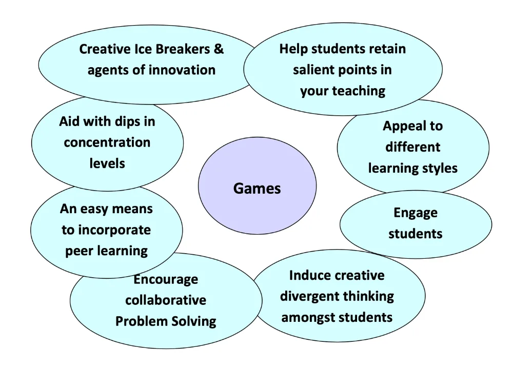

# Digital Game Based Learning
an introduction  
by Video Games Without Borders

---

Game based learning (GBL) is a type of _game play_ that has _defined learning outcomes_. 

**Digital** game based learning (DGBL) refers to using actual digital video games as learning tools.

---

# GBL is NOT gamification
Game-based learning should not be confused with gamification.

Gamification takes an element of education and replaces it with a game-based element. For instance, a teacher may replace grades with levels or experience points.

---

# VideoGame types

several types of games may be used in digital game-based learning:

- **Educational Games**: use an engaging and immersive learning experience to deliver specified learning goals, outcomes and experiences.
- **Online Games**: range from simple text-based games to games that span complex, virtual worlds used by large numbers of players simultaneously.
- **Serious Games**: train or educate users; generally, serious games have a primary purpose other than entertainment.
- **Simulations**: model real-world situations.

---

# DGBL Domains

- Language Learning
- Mathematics and Science (STEM)
- Social Studies and History
- Development of Cognitive Skills

---
# Principles

- A **safe environment** to explore and in which to **make mistakes**
- Learning through enjoyment and "fun"
- Contextualised, goal oriented instead of abstract learning
- Experiential learning: learning by doing
- Intrinsic motivation: playing is voluntary and self-driven
- Seamless accountability and feedback
- Combine audio, graphics and movement into an interactive and immersive environment
- Age and culture appropriate

---
## Mechanisms

- A fictional or real world setting
- Progressive difficulty levels and appropriate challenge
- Immediate and constructive feedback
- A social element that allows people to share experience and build bonds
- Clear, achievable goals, rules, measurable outcomes and rewards

---
# Videogames

Games bring together combination of motivating elements not found together in any other medium.

**Games**:

- are a form of fun -> _enjoyment and pleasure_
- are a form of play -> intense and passionate _involvement_
- are rules -> _structure_
- are goals -> _motivation_
- are interactive -> _doing_
- are adaptive -> _flow_
- have outcomes and feedback -> _learning_
- have a win state -> ego _gratification_
- have conflict/competition/challenge/opposition -> _adrenaline_
- have problem solving -> sparks _creativity_
- have peer interaction -> _social groups_
- have characters and story -> _emotions_

---
## 36 Learning principles in VideoGames
| | |
|---|---|
|1. Active, Critical Learning Principle |_All aspects of the the learning environment are set up to encourage active and critical, not passive, learning_|
|2. Design Principle | _Appreciating good design_ |
|3. Semiotic Principle  | _Seeing interrelations within and across multiple sign systems (images, words, actions, symbols, artifacts, etc.) as a complex system is core to the learning experience_ |
|4. Semiotic Domains Principle | _Mastering game languages and participation in the affinity groups connected to them_ |
|5. Metalevel Thinking About Semiotic Domains Principle | _Relating the game world to other worlds_|
|6. "Psychosocial Moratorium" Principle | _Taking risks with reduced consequences_|
|7. Committed Learning Principle | _Putting out effort because they care_|
|8. Identity Principle | _Combining multiple identities_|
|9. Self-Knowledge Principle | _Watching their own behaviour and their current and potential capacities_|
|10. Amplification Of Input Principle | _For a little input, learners get a lot of output_|
|11. Achievement Principle | _intrinsic rewards from the beginning, customised to each learner's level, effort, and growing mastery and signaling the learner's ongoing achievements_|
|12. Practice Principle | _Being encouraged to practice in a context where the practice is not boring_|

<!-- slide vertical=true -->

|  |  |
|---|---|
|13. Ongoing Learning Principle | _Having to master new skills at each level, with cycles of new learning, automatization, undoing automatization, and new re-organized automatization_|
|14. "Regime Of Competence" Principle | _Tasks being neither too easy nor too hard._|
|15. Probing Principle | _Learning is a cycle of probing the world (doing something); reflecting in and on this action and, on this basis, forming a hypothesis; reprobing the world to test this hypothesis; and then accepting or rethinking the hypothesis_|
|16. Multiple Routes Principle | _There are multiple ways to make progress or move ahead. This allows learners to make choices, rely on their own strengths and styles of learning and problem-solving, while also exploring alternative styles_|
|17. Situated Meaning Principle | _Discovering meaning of signs (words, actions, objects, artifacts, symbols, texts, etc.) situated in embodied experience_|
|18. Text Principle | _Texts are not understood purely verbally but are understood in terms of embodied experience_|
|19. Intertextual Principle | _Relating information_|
|20. Multimodal Principle | _Meshing information from multiple media (images, texts, symbols, interactions, abstract design, sound, etc.), not just words_|
|21. "Material Intelligence" Principle | _Understanding how knowledge is stored in material objects and the environment_|
|22. Intuitive Knowledge Principle | _Intuitive or tacit knowledge built up in repeated practice and experience. Not just verbal and conscious knowledge is rewarded_|
|23. Subset Principle | _Practicing in a simplified setting_|

<!-- slide vertical=true -->

|  |  |
|---|---|
|24. Incremental Principle | _Being led from easy problems to harder ones_ |
|25. Concentrated Sample Principle | _Mastering upfront things needed later_ |
|26. Bottom-Up Basic Skills Principle | _Repeating basic skills in many games_ |
|27. Explicit Information On-Demand Just-In-Time Principle | _Receiving information just when it is needed_ |
|28. Discovery Principle | _Experiments and Trying rather than following instructions_ |
|29. Transfer Principle | _Applying learning from problems to later ones_ |
|30. Cultural Models About The World Principle | _Thinking about the game and the real world_ |
|31. Cultural Models About Learning Principle | _Thinking about the game and how they learn_ |
|32. Cultural Models About Semiotic Domains | _Thinking about the games and their culture_ |
|33. Distributed Principle | _Meaning/knowledge is distributed across the learner, objects, tools, symbols, technologies, and the environment_ |
|34. Dispersed Principle | _Sharing knowledge with others outside the domain/game_ |
|35. Affinity Group Principle | _Being part of the gaming world and affinity groups bonded by the game and not shared race, gender, nation, ethnicity, or culture_ |
|36. Insider Principle | _Helping others and modifying games, in addition to just playing_ |

---
## Flow

---
## Flow emotions

---

---
# Learning

---

# DGBL approach

- introduction to videogame (+coach: tech + expectations)
- gameplay / experience (autonomous)
- game results / scores (autonomous)
- reflection / analysis (+coach)
- forming abstract concepts + real world application

---

# Coach Skills
- ICT / Basic Digital Skills
- Minimal game playing experience
- Deep understanding of how a game can help learning and its differences with a  classic book/course
- Recognise different players skills and support their game play
- Engage students in playing and progression

---

# Assessment
Using games for assessment is more than games scores. 

Assessment happens around a game more often than it happens inside the game, and teachers/coaches must still design and provide authentic, useful assessment tasks for students.

---

# Development options

- Use entertainment/commercial games (Assassin's Creed / Civilization)
- Modify entertainment games (Kerbal Space Academy)
- Use virtual worlds (Minecraft)
- Use educational games (MinecraftEdu)
- Create games (Antura)
- Students create games

---

# Domain Expert

---
# Game Model

---
# Objectives of learning analytics

---

# GBL challenges
**Curriculum**: identify how a certain game can connect to the curriculum. 

**Game related**: identify the accuracy and appropriateness of the content of the game. Irrelevant or distracting content from the game that could not be removed.

**Attitudes**: persuading all stakeholders and non-players about the educational value of the game.

**Educators and Teachers support**: make them aware of how to use games more effectively in education.

**Assessment**: Traditional assessments do not often align with GBL, so new models and approaches must be considered.

**Developers** encourage and support game developers in the creation of better educational games
