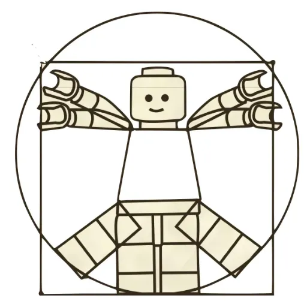

<!-- _backgroundColor: #007C77 -->
<!-- _color: #fff -->
<!-- fit -->
# Il lavoro dietro la decima arte

L'evoluzione della creatività e tecnologia con i videogiochi

[👉🏼 slides](https://2042ed.org/studio/monografie/gamedev_intro_slides.html)

di Stefano Cecere

---

<!-- paginate: false -->

## In 50 anni siamo passati da...

---
## a...
<iframe width="800" height="600" src="https://www.youtube.com/embed/BMIIrNgX-F8?start=37" title="The History and Evolution of Videogame Design - The Game Design Extracts Episode 1" frameborder="0" allow="accelerometer; autoplay; clipboard-write; encrypted-media; gyroscope; picture-in-picture; web-share" referrerpolicy="strict-origin-when-cross-origin" allowfullscreen></iframe>
[youtube](https://youtu.be/BMIIrNgX-F8?t=37)

---

## da

---
## a...
<iframe width="800" height="600" src="https://www.youtube.com/embed/lcHAo8ViDT8" title="The History and Evolution of Videogame Design - The Game Design Extracts Episode 1" frameborder="0" allow="accelerometer; autoplay; clipboard-write; encrypted-media; gyroscope; picture-in-picture; web-share" referrerpolicy="strict-origin-when-cross-origin" allowfullscreen></iframe>
[youtube](https://youtu.be/lcHAo8ViDT8)

---

## Chi sono: Stefano Cecere

_tecnologia, giochi, educazione_ 

- Iniziato ad hackerare i computer a 10 anni, primo VG in terza Liceo
- Sviluppo videogiochi @ **[Videogames Without Borders](https://vgwb.org/)**
- Game Based Learning e EdTech @ **[Future Education Modena](https://fem.digital/)**
- Docente Game A.I. / XR / OpenSource / Giochi applicati @ **[TheSign Academy](https://thesign.academy/)**
- Condivido sul sito [2042ed.org](https://2042ed.org/)

---

## Pong (1972) e l'era arcade

- davanti allo schermo, insieme, a giocare
- Programmazione semplice, design minimalista.
- [codice sorgente](https://gist.github.com/straker/81b59eecf70da93af396f963596dfdc5)

---
<!-- _backgroundColor: green -->
<!-- _color: white -->
## <!-- fit --> Q: Video vs Videogame?
* sono entrambi *medium*
* ma qual è la più grande differenza?

---
### L'Interattività

---

### C'è intelligenza che interagisce
il nostro giocatore, un agente "intelligente"

a differenza di libri e film e musica che possono andare in play da soli, un videogioco, no!

---

### Il loop

---
### Controllers

---

## Chi fa un videogioco?

* Game Designer
* Game Developer
* Artists

---

## Avventure Testuali

Esempi: *Zork*, *Colossal Adventure* (1977-1980).

Enfasi sulla scrittura e sulla creazione di mondi attraverso la narrativa.

---

## Coding: Codifica del testo

---

## Design: mappe

<!--
commenti di descrizione
qui ci va il racconto
-->

---

## Art: schermate

Arriva la grafica

---

## Q: percezione o immaginazione?

- Hai mai videogioco senza immagini, solo con testo?
- Quale aspetto di un videogioco prediligi: la grafica o la storia?

---

## Avventure grafiche Punta e Clicca

- *Monkey Island* (1990)
- The Dig
- Thimblewood Park

<!-- Introduzione all'arte digitale e all'importanza delle interfacce intuitive, con focus sulla narrazione visiva.-->

---

### Q: storie lineari o interattive?

Quali sono le differenze tra i videogiochi in cui segui una storia predefinita e quelli in cui puoi influenzare la storia? Quale preferite?

---
### Myst (1993)

Primo gioco a fare un uso massiccio di grafica pre-renderizzata e **una narrativa non lineare**. Oltre a enigmi davvero sfidanti.

---

## Pac Man e gli avversari
con Pac Man (1980) arrivano gli avversari, ovvero Intelligenze Artificiali antagoniste.

---

---

### Street Fighter II (1991)

Innovativo per il combattimento a due giocatori e per l'introduzione delle combo, una meccanica che ha definito i giochi di combattimento successivi.

---

## Doom e il 3D

- *Doom* (1993): primo salto nel 3D.
- Quake

come pietra miliare del rendering 3D. Introduzione ai motori grafici e alla programmazione in tempo reale.

---

## L'arte nei videogiochi

---

---

---

### Assassin's creed e la storia

---

## La scienza del Game Design

- Cosa rende un gioco coinvolgente?
- Le meccaniche di gioco, l'equilibrio tra sfida e ricompensa, e il design delle dinamiche che tengono il giocatore agganciato.

---

### Progressione e ricompense

- Come i giochi creano motivazione e soddisfazione attraverso la progressione (livelli, esperienze, abilità sbloccabili) e le ricompense (oggetti, potenziamenti, riconoscimenti). Questo aiuta a mantenere il giocatore coinvolto.

---

### Pokémon Rosso e Blu (1996)

Innovativo per l'idea di "collezionare" creature, creando una rete di interazione tra giocatori attraverso lo scambio. È diventato un fenomeno culturale, unendo narrazione, strategia e game design.

---

### Dinamiche di Gioco e Interazione Sociale

- I giochi multiplayer e cooperativi creano dinamiche sociali uniche.
- Esempio: _Among Us_ ha reso la comunicazione e il bluff centrali nell'esperienza di gioco.

---

### World of Warcraft (2004)

 Massively Multiplayer Online Role-Playing Game (MMORPG) che ha cambiato il modo di concepire i mondi persistenti online, introducendo meccaniche sociali complesse e un'economia virtuale.

---

### Wii Sports (2006)

Ha portato i videogiochi nel salotto di famiglie di tutto il mondo grazie ai controlli basati sul movimento. È stato cruciale per la diffusione del motion gaming e del gioco accessibile a un pubblico non tradizionale.

---

### Portal (2007)

Innovativo per la sua meccanica basata sui portali e per la narrazione integrata con il gameplay.

---
### SimCity (2000) e la gestione di sistemi complessi

---

### Bilanciamento

---

#### nel giusto mezzo

Il bilanciamento tra difficoltà e accessibilità è cruciale. I designer devono considerare curve di apprendimento e diversità dei giocatori per evitare frustrazioni o noia

--- 

### Tetris (1984)

Un capolavoro di game design minimalista, con una logica semplice ma profonda. Ha introdotto la formula dei puzzle a caduta, diventando uno dei giochi più longevi e venduti di sempre.

---

### Space Invaders (1978)

Uno dei primi grandi successi arcade. Innovativo per l'uso della progressiva difficoltà, che aumentava man mano che i nemici si avvicinavano al giocatore.

---

### Esperienza Utente (UX) e Interfaccia Utente (UI)

- Un buon game design considera attentamente come i giocatori interagiscono con il gioco. Una UI intuitiva e una buona UX rendono l’esperienza fluida e piacevole.
- Esempio: _The Last of Us_ offre una UI pulita e minimale che non distrae dall'immersione.

---

### Level Design

- La costruzione degli ambienti di gioco e il posizionamento di sfide e nemici all'interno di essi è cruciale per il ritmo e la narrativa. Ogni livello racconta una storia attraverso il design.

- Esempio: _Super Mario Bros._ è noto per il design di livelli che insegnano al giocatore nuove meccaniche senza bisogno di tutorial espliciti.

---

### Super Mario Bros (1985)

 Pietra miliare nel design dei platform 2D, introdusse meccaniche precise di controllo e un level design che insegnava al giocatore le regole del gioco attraverso l'esperienza diretta.

---

### Psicologia del gioco e motivazione intrinseca

- Capire perché le persone giocano è fondamentale. La teoria della motivazione intrinseca (autonomia, competenza, relazione) e la psicologia del flusso (flow) sono centrali nel design di esperienze coinvolgenti.
- Esempio: _Animal Crossing_ fornisce una forte sensazione di autonomia e relazione, contribuendo al suo successo duraturo.

---

### Scelte e conseguenze

- Dare ai giocatori la possibilità di fare scelte significative che influenzano la trama o l'esito del gioco rende l'esperienza più personale e coinvolgente.
- Esempio: _Mass Effect_, dove le scelte del giocatore influenzano significativamente lo sviluppo della storia.

---

### Game Feel

- Il "game feel" riguarda come il gioco "si sente" in termini di risposta ai controlli, animazioni fluide e feedback tattili o visivi che amplificano l'interazione del giocatore con il mondo di gioco.
- Esempio: _Celeste_, con controlli molto precisi e responsivi che migliorano l’esperienza di platforming.

---

### Monetizzazione e Design Etico

- Con la crescita dei modelli free-to-play, è importante parlare delle pratiche di monetizzazione (microtransazioni, loot box) e delle sfide etiche che queste pongono in termini di design e responsabilità verso i giocatori.

---

### Fortnite (2017)

 Innovativo per la combinazione di un battle royale e un sistema di costruzione in tempo reale, unito a un modello free-to-play che ha ridefinito il mercato dei giochi online e il concetto di giochi come servizi (games as a service).

---

### Narrativa Emergente

- La narrativa emergente è quella che viene generata spontaneamente dall’interazione dei giocatori con il mondo di gioco, piuttosto che dalla trama predefinita.

---
### Minecraft (2011)

Ha introdotto il concetto di sandbox totale, permettendo ai giocatori di costruire e creare liberamente in un mondo infinito. Ha aperto la strada al genere "creativo" e ha dimostrato il potere del gioco emergente.

---

### Narrazione Interattiva

- *Final Fantasy*, *The Last of Us*: narrazione interattiva e scelte narrative.

---

## Giochi Mobile

- Dalla semplicità di *Snake* ai giochi complessi come *Angry Birds*.
e _Candy Crush_, e come ha cambiato il mercato e il design.
- L'importanza del design accessibile.

---

## Musica, Maestri

---

### Journey (2012)

Il suo contributo è stato particolarmente rilevante grazie alla colonna sonora dinamica e interattiva composta da Austin Wintory. La musica in _Journey_ non è solo un accompagnamento, ma si adatta alle azioni e alle emozioni del giocatore, creando un'esperienza profondamente immersiva.

---

<!--
- Musica interattiva in giochi come *Journey* e *Rez*.
- Come la colonna sonora influenza l'emozione.
-->

---

## Grafica e Modellazione 3D

---

---

---
### blender.org

---
### tinkercad.com

---

### Rigging e Animazione

<!--
- Il processo di **rigging** è fondamentale per dare vita ai modelli 3D attraverso l'animazione. Un esempio notevole è _Shadow of the Colossus_ (2005), dove i colossi sono modelli enormi che richiedono un rigging complesso per permettere movimenti fluidi.
- I software moderni come **Maya** e **Blender** sono standard nell'industria per il rigging e l'animazione, ed hanno permesso di ottenere risultati sempre più realistici.
-->

---

### Procedural Generation

- La **generazione procedurale** di ambienti e oggetti è diventata sempre più popolare, specialmente in titoli come _No Man's Sky_ (2016), che genera in modo procedurale interi pianeti e universi.

---

---

## Programmazione

---

### Dominio digitale

---

### Codice Binario

---
### Codice o blocchi?

---

### Visual scripting

---

### Graphics Programming: Shaders

Gli **shader** sono piccoli programmi che definiscono il comportamento della luce e il rendering delle superfici nei videogiochi. I giochi moderni fanno uso massiccio di shader complessi per creare effetti realistici di luce, ombre e riflessioni.

---

---

### Simulazione Fisica e Collision Detection

- La simulazione fisica è fondamentale per creare movimenti realistici e interazioni tra gli oggetti. _Half-Life 2_ (2004) è stato uno dei primi giochi a fare uso estensivo del motore fisico **Havok**, introducendo oggetti interattivi e dinamiche fisiche realistiche nel gameplay.

---

### AI e Pathfinding

Il **pathfinding** è la tecnica usata per far sì che gli NPC trovino il percorso migliore all'interno di un ambiente complesso. Giochi come _F.E.A.R._ (2005) hanno rivoluzionato l'IA dei nemici, rendendoli più intelligenti e adattabili.

---

### Intelligenza Artificiale nei videogiochi

- L'evoluzione dell'IA nei nemici e NPC.

---

### The Legend of Zelda (1986)
Introduzione di un mondo aperto da esplorare, combinando elementi d'avventura, azione e puzzle-solving, un mix di meccaniche che ha influenzato interi generi.

---

### Grand Theft Auto III (2001)

Ha rivoluzionato il concetto di mondo aperto in 3D, permettendo ai giocatori di esplorare liberamente un ambiente urbano dettagliato con una grande libertà d'azione e scelte.

---

### AI: Behaviour Trees

---

---

#### Q: la miglior Intelligenza

Qual è il comportamento più intelligente che avete visto in un nemico o in un personaggio non giocante? Cosa rende un'IA nei videogiochi davvero convincente?

---

### Rendering in tempo reale

- Il **ray tracing** in tempo reale è una tecnologia avanzata che simula come la luce interagisce con gli oggetti in modo estremamente realistico. Questo è stato introdotto recentemente in giochi come _Cyberpunk 2077_ e _Minecraft RTX_, cambiando il modo in cui la luce e le ombre vengono rappresentate.

---

## Il Futuro dei Videogiochi

<!--
- Realtà virtuale e aumentata, AI avanzata e le nuove tecnologie.
- Come influenzeranno i giochi futuri.
-->
---

## Economia

---

## Come si sviluppa un gioco?

---

### Consigli per iniziare

- "giocare" con i tutorial (unity, unreal)
- canale youtube
- copiare giochi (semplici) esistenti
- Game Jams
- parlate con il vostro prof!

---

### Strucked (Unity online)

- gratuito
- web
- facile
- multigiocatore
- visual scripting

[👉🏼play.unity.com](https://play.unity.com)

---

### Roblox Studio

- gratuito
- PC
- completo
- LUA
- multiplayer

[👉🏼create.roblox.com](https://create.roblox.com/)

---

### GameMaker

- gratuito
- 2D
- facile
- visual scripting

[👉🏼gdevelop.io](https://gamemaker.io/en/tutorials)
[Tutoriales](https://gamemaker.io/en/tutorials)

---
### GDevelop

- gratuito
- web / pc
- visual scripting
- italiano

[👉🏼gdevelop.io](https://gdevelop.io)
[👉🏼academy](https://gdevelop.io/it-it/academy)

---

### Godot

- gratuito
- completo
- opensource
- in crescita

[👉🏼godotengine.org](https://godotengine.org/)

---
### Global Game Jam

migliaia di giochi, tutti con codice sorgente

[👉🏼 cerca giochi](https://globalgamejam.org/games/2024)

---

<!-- _backgroundColor: #007C77 -->
<!-- _color: #fff -->
<!-- fit -->
## <!-- fit -->Buon lavoro!

