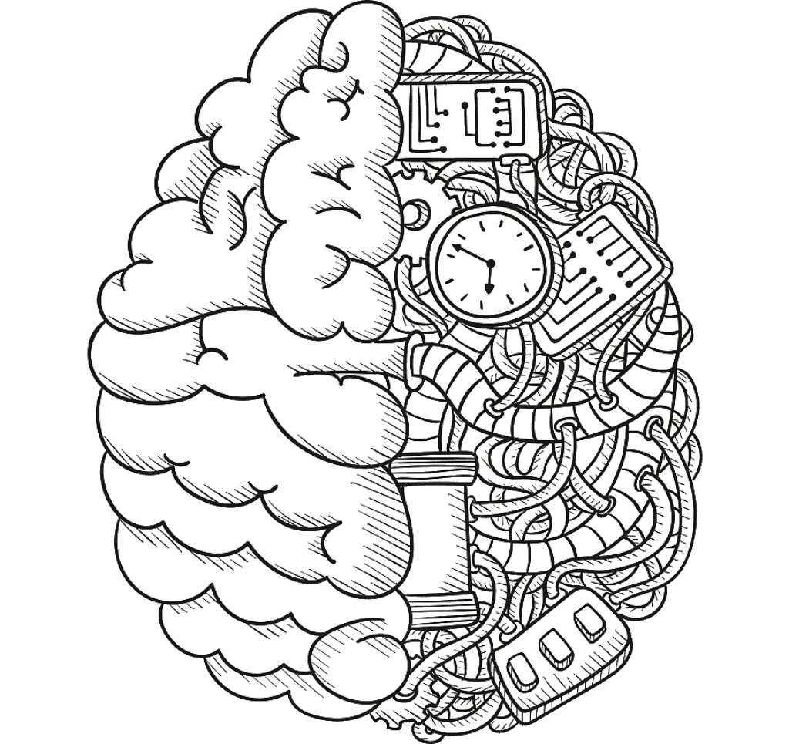

# Umanesimo, Videogiochi, Intelligenza Artificiale e Realtà Virtuale
`data: 17 aprile 2021`

> Le avanguardie nella ricerca e sviluppo nei campi dell'AI e della XR sono sempre più interconnesse con la fisiologia e la psicologia umana e con questioni filosofiche che richiedono un approccio interdisciplinare e scelte etiche, in vista di un'imminente diffusione massiva e popolare di queste tecnologie. Gli sviluppatori di videogiochi potrebbero essere i prossimi a dover rispettare un giuramento di Ippocrate?

ecco la presentazione del 17 aprile 2021: [youtube](https://youtu.be/C9UvZYSwkTs)

Negli ultimi anni si sente parlare sempre più spesso di umanesimo non solo in economia, in politica, in ecologia, ma anche nel mondo della tecnologia: umanesimo digitale, digital humanities, *Human Centered Design*, filosofia ed etica umaniste, soprattutto nelle avanguardie informatiche: intelligenza artificiale e realtà virtuale.  
Non tratterò tanto i numerosi benefici o i temuti pericoli, che rimando ad altri momenti o ai materiali dei miei corsi, quanto vorrei fare alcune considerazioni che mi hanno particolarmente colpito da un punto di vista umanista, ovvero dalla mia preoccupazione e interesse per l’essere umano come valore centrale, attore e autore del mondo in cui viviamo, a cui garantita e migliorata la libertà e la capacità di scelta, riconoscendone le diversità personali all’interno di un sistema umano planetario.

## Videogiochi
Iniziamo con i **videogiochi**:
1. sono il medium del nuovo millennio
2. possono essere considerati medium "umanisti"
3. sono l'ambito ideale per sviluppare gli altri due argomenti: intelligenza artificiale e realtà virtuale

### Il circuito
Nel mondo del gioco e del ludismo i videogiochi hanno una caratteristica peculiare: sono sistemi autonomi che permettono esperienze interattive seguendo questo schema:

Il giocatore, consideriamolo umano per il momento, è al *centro* del circuito, come un agente senziente e intelligente che percepisce, elabora decisioni e le attua andando a modificare l'ambiente e ottenendo risultati e sensazioni, l'esperienza di gioco appunto.

A differenza dei giochi a "turni" (tipo gli scacchi) dove il tempo è sospeso tra una decisione e l'altra, quasi sempre i videogiochi si svolgono in tempo reale, ovvero si gioca immersi nel tempo con l'effetto di una maggiore e costante tensione, coinvolgimento intellettuale, emotivo e motorio. Il giocatore vive all'interno di un *flusso* non solo spaziale, ma anche temporale.

Questo circuito di interattività in tempo reale differenzia il medium videogioco da tutti gli altri medium "passivi", ovvero dove si è solo spettatori, o al massimo si interagisce parzialmente.

Ultimamente i videogiochi sono sviluppati per rendere l'esperienza ludica il più  coinvolgente possibile, anche adattando i contenuti di gioco (difficoltà, ambientazioni, elementi grafici e sonori, comportamento dei personaggi, addirittura la storia) in funzione della diversità fisica, culturale, psicologica, delle capacità e delle scelte del giocatore.

Per _cucire_ al meglio le esperienze intorno ai giocatori, come fossero dei sarti multimediali, i creatori di videogiochi sono sempre più attenti alla psicologia, alla sociologia, alla filosofia e alla fisiologia umana.

### Multiplayer

Grazie a internet una nuova dimensione del videogioco è quella sociale, multiplayer, reti fino a milioni di giocatori online contemporaneamente che interagiscono con i propri *avatar*, creazioni e proiezioni del proprio Io in altri mondi dove le dinamiche di relazione interpersonale sono forse più importanti di ogni altro aspetto del gioco.

### Non solo entertainment

Il videogioco nasce nel mondo della ricerca informatica e dell'intrattenimento, ma oggi si sta facendo strada in molti altri ambiti al di là del puro intrattenimento: giochi educativi, di simulazione, terapeutici, culturali, artistici, psicologici, sportivi, di ricerca.

### Un medium umano-centrico

Questi elementi di interattività, contenuti adattati, multiutenza, immersività, creatività multidisciplinare, rendono il videogioco un medium davvero "umano centrico" che si interessa di moltissimi aspetti del giocatore. E se i game designer avessero davvero a cuore la crescita, lo sviluppo, il benessere dell'umano in gioco, il potenziale è impressionante.

## Intelligenza Artificiale

L'idea di un essere intelligente che non sia umano è molto antica.
Con lo sviluppo dei linguaggi formali e della tecnologia si è iniziato a *pensare* a come *creare* l'intelligenza, ma sono state le tecnologie digitali e informatiche a permettere di sviluppare i primi prototipi di A.I.

I videogiochi sono sempre stati l'ambito ideale e preferito per la ricerca, proprio perché sono ambienti chiusi, delimitati, programmati, dove un *agente* può muoversi basandosi sul meccanismo di percezione, elaborazione, risposta.

Uno dei metodi usati in tecnologia per risolvere un problema è "copiare come funziona la natura", così si è iniziato una profonda ricerca su come funziona l'intelligenza umana, come si sviluppa, come fa ad imparare. Le scienze cognitive, la neurologia, la psicologia, la filosofia, la fisiologia, sono tutte impegnate sul fronte umano e sul fronte artificiale cercando corrispondenze e formalizzando modelli, spesso usando gli stessi termini, come le reti neurali, ad esempio, che sono alla base della AI contemporanea.

### Machine Learning

Non percorro ora la storia e i traguardi raggiunti dall'Intelligenza Artificiale, dico solo che il grande salto in avanti è arrivato intorno al 2010 non solo grazie alla potenza di calcolo dei computer, ma soprattutto dalla disponibilità di grandi quantità di dati, i famosi "big data", che hanno permesso di testare il **Machine Learning**, fino ad allora una teoria degli anni '80, che è ad oggi la più riuscita delle metodologie di AI, perché effettivamente dà risultati non solo interessanti, ma quasi sempre superiori alla capacità umana media.

Questa faccenda del "learning" è fondamentale nel momento in cui vogliamo macchine che imparino da sole in un qualsiasi ambiente o sistema, ed è poi anche molto peculiare allo sviluppo di un essere umano. Di fatto la comparazione avviene sempre: c'è un possibile metodo o possibilità di strutturare un pensiero "intelligente"? Per realizzare ciò si studia molto come imparano gli esseri umani, riproducendo ad esempio i meccanismi di curiosità, di analisi dei risultati delle proprie azioni, di analisi degli errori, di ripetizione di ciò che funziona.

Ma torniamo al Machine Learning, ovvero la capacità di un computer di imparare qualcosa in modo autonomo. A dir la verità non è niente di sorprendente: è pura statistica su un'analisi di milioni di dati, e della creazione di un modello di previsione. Ma la novità è che questo modello se lo crea e se lo aggiorna da solo il computer!

E' possibile far imparare in diversi modi, qui ne accenno tre:

#### Supervised Learning

Ricordate che per molti anni sul web, per confermare l'invio di una form, ci chiedevano di leggere una parola o dei numeri dentro una foto (sembravano parole di un libro o i numeri civici delle case)? Ultimamente ci chiedono di riconoscere le strisce pedonali o i semafori, o Facebook ci chiedeva di taggare gli amici nelle foto.  
Sapete cosa abbiamo fatto negli ultimi 15 anni, e stiamo ancora facendo?  
Avete intuito bene: abbiamo creato una mole di dati "etichettati" correttamente, affinché le macchine potessero imparare la corrispondenza tra un'immagine e il suo contenuto. Così oggi le macchine sono bravissime a riconoscere i testi scritti o le auto a guida autonoma sono sempre più precise nel riconoscere quello che vedono, e Facebook ora sa riconoscere chi sono i nostri amici nelle foto.

Questo è il Supervised Learning, dove noi siamo gli insegnanti e diamo alle macchine i dati da cui imparare.  
Il problema maggiore di oggi derivano da eventuali risposte un po' troppo "condizionate" (_biased_) perché l'A.I. impara dai dati che ha analizzato, e se questi sono parziali, così sarà la risposta che darà.

#### Reinforced Learning

Prendiamo un "agente" ovvero un'entità dotata di sensori e attuatori e lo mettiamo in un ambiente, ad esempio dentro un campo da tennis virtuale e gli diciamo: questa è una palla e se la fai cadere due volte nel tuo campo, perdi, ma se la fai cadere due volte oltre la rete, vinci. Puoi solo spostarti e colpire la palla per farla rimbalzare. Vai.  
Non diremmo così a nostro figlio, vero? Però se il nostro "agente" virtuale avesse molto tempo per fare qualche milione di partite tentando a caso e ricevendo premi o punizioni e cercando di ripetere quei movimenti che portano con maggiore probabilità ai premi, allora potrebbe imparare.
E il bello è che impara, e anche in modo sorprendente!
(Vi lascerò dei link per vedere qualche esempio pratico)

#### Imitation Learning

A nostro figlio faremmo vedere come si gioca, vero? e gli diremmo: “fai come me. colpisci la palla in questo modo, muoviti così etc.”  
Possiamo quindi programmare le AI per osservare il comportamento umano, registrarlo e analizzarlo insieme all'ambiente e ai risultati, e poi imitarlo.  
Funziona. E molto bene. Osservandoci e imitandoci.

### Umanizzazione digitale

Negli anni ‘80, con i primi sequencer musicali al computer, per risolvere il problema che la musica fatta al computer era troppo perfetta, risultando meccanica, quasi fastidiosa, si introdussero funzioni di “humanizer” che rielaboravano la musica introducendo imperfezioni.  
Come risultava fastidiosa la musica, così risulta noioso e frustrante un avversario AI troppo bravo, o un robot dalle sembianze troppo umane, che crea quello che si chiama effetto “Uncanny valley” che genera disagio.  
Così si sviluppano sempre più metodi per umanizzare al meglio gli artifici digitali o robotici che devono interagire con gli esseri umani

### Dati, opinioni e comportamento

Le AI lavorano sui nostri dati. E i nostri dati non mentono.
Io posso dire ad esempio di amare tantissimo gli animali e l'ambiente e di essere quindi vegetariano. Ma se i dati dei miei acquisti alimentari dicono che compro carne tutti i giorni, non ci crede nessuno.
E se dai dati della nostra vita e della società riescono ad estrapolare dei modelli di personalità psicologica e di comportamento tali da conoscerci meglio di noi stessi? tali da predire le nostre intenzioni?
Questa non è fantascienza ma è già realtà.

### Illusioni e creatività

Un aspetto sorprendente delle AI è la capacità di creare nuovi contenuti o di modificare quelli esistenti: parliamo di **deep fakes** ad esempio.  
Il principio di funzionamento è semplice: così come una AI impara a riconoscere ad esempio un viso, partendo da una foto e codificandone le caratteristiche essenziali con un algoritmo e parametri validi per _tutti_ i visi, così può partire dai dati codificati, e ricostruire il viso. e se cambio i dati con quelli di qualcun altro, mi ricostruirà con un'altra faccia!

Non posso dilungarmi su questo mondo davvero affascinante quanto preoccupante, ma il punto che ci interessa è che le AI sono ormai in grado di creare qualsiasi tipo di contenuto digitale (grafico, sonoro, testuale), e dovremmo iniziare a chiederci: **cosa è Reale?**

### Etica ed essere umani
La vera sfida per i ricercatori è ottenere una Intelligenza Artificiale "forte" ovvero totalmente autonoma, creativa, universale, che sappia trovare le migliori risposte in ogni situazione imprevista.

e qui nascono due temi finali:

#### 1. Comportamento e decisioni **etiche**.  

E' molto famoso il "dilemma del tram": un'auto a guida autonoma che deve urgentemente rispondere ad un'emergenza con due sole possibilità: non facendo niente investi 5 persone, ma sterzando ne investi solo 1: cosa deve fare?
chi decide? chi è il responsabile?

#### 2. Cosa siamo noi umani?  

se le AI faranno meglio di noi tutto ciò che si può automatizzare, qualcuno ipotizza che potrebbero essere loro a colonizzare lo spazio!, riusciremo a delegare tutto e concentrarci su ciò che è propriamente umano? cosa è che ci rende umani e che ci differenzia dalle macchine?

Non è un caso che oggi tutti i centri ricerca assumano più filosofi che informatici.

## Realtà Virtuale

Dovremmo conoscere tutti il film Matrix e Ready Player One: nel primo gli esseri umani vivono l'illusione artificiale della realtà, nel secondo la maggior parte dell'umanità vive in realtà virtuali.  
Oggi ci sono molti personaggi che si domandano seriamente se non stiamo vivendo in una realtà "virtuale" e le grandi industrie dei social networks e dell'intrattenimento si stanno impegnando molto in questa direzione.
E' una questione di decenni, non di secoli.

La VR (Virtual Reality) sta raggiungendo livelli di **immersività** sempre più sofisticati, con un potenziale tutto da valorizzare (educativo, formativo, culturale, sportivo, sociale, lavorativo).  
Ed è interessante meditare su come funziona tutto questo: con la  **sabotazione dei nostri sensi**.

|Sense|Stimulus|Receptor|Sense Organ|
|---|---|---|---|
|Vision|Electromagnetic energy|Photoreceptors|Eye|
|Auditory|Air pressure waves|Mechanoreceptors|Ear|
|Touch|Tissue distortion|Mechanoreceptors, Thermoreceptors|Skin, muscles|
|Balance|Gravity, acceleration|Mechanoreceptors| Vestibular organs
|Taste/Smell|Chemical composition|Chemoreceptors|Mouth, Nose|

Se l'essere umano percepisce il mondo esterno grazie ai sensi e il mondo interno grazie alla cenestesia (sensazioni interne) e propriocezione (la consapevolezza della nostra posizione nello spazio), nessuno vieta di far arrivare a questi sensi dei segnali artificiali, tanto da ingannare la nostra coscienza fino ad immedesimarsi e credere che sia tutto reale.
Ad oggi la vista e l'udito sono i più ingannati e solo loro basterebbero, ma ci sono progressi anche su tatto, olfatto, gusto e sensazioni cenestesiche.

Il problema? se l'inganno non è perfetto e c'è una minima discordanza tra le percezioni sabotate e le sensazioni interne, si crea malessere, ed è interessante sapere che i grossi problemi che si hanno nel progettare esperienze in VR derivano da una superficiale o trascurata attenzione alla fisiologia umana.

### Empatia

"cammina nelle mie scarpe" sintetizza molto bene il tema dell'empatia, e la VR è uno strumento magnifico per provare a mettersi nelle scarpe degli altri: che sia una persona del sesso opposto, fisicamente diversa, più alta, più bassa, disabile, daltonica, o che viva in un campo profughi dall'altra parte del mondo o in un letto d'ospedale, c'è chi ha addirittura simulato di essere imprigionati, o di essere dei biscotti e mangiati a colazione!  
Vivere le esperienze degli altri in prima persona può cambiare la vita.

### VR sociale

la vera rivoluzione della VR sarà con i social: se io e te ci incontriamo con i nostri avatar in uno spazio virtuale e avremo percezioni perfette, dove saremo noi? Qui o là? Cosa mi definisce? il mio corpo o la mia coscienza? Ma di cosa sarò cosciente? Sono tutte domande molto interessanti, vero?

### Realtà Aumentata
La costruzione di nuove realtà non avviene solo con la creazione di mondi  sintetici: la Realtà Aumentata si differenzia per avere come base la realtà che ci circonda, ma aggiungendone contenuti artificiali, plastici o informativi, facendoli sembrare perfettamente integrati.

La realtà non è più la stessa, non è più _oggettiva_.
Non solo il punto di vista ma anche il contenuto oggi lo decidiamo noi e possiamo "arricchire" la realtà, la percezione della realtà, con contenuti artificiali e informazioni.

Tra la realtà aumentata e la realtà virtuale c’è quella che sia chiama Realtà Mista dove si può interagire con gli elementi sintetici e questi reagiscono all’ambiente reale (una palla virtuale che rimbalza su un tavolo reale o un personaggio che si nasconde dietro ad un albero reale, ad esempio).

Oggi c'è un nome per questo mondo delle realtà modificate: XR (Extended Reality)

### Connessioni neurali e reale/irreale

Pensiamo ora che tutte queste interfacce di input/output, percezione e attuazione, saranno un giorno connesse direttamente al nostro cervello.  
Sappiamo che sarà così perché i prototipi esistono già: ad esempio esistono dei braccialetti che leggono i segnali nervosi nel polso e riescono a ricostruire al millimetro i movimenti di tutte le dita.  
Nel momento in cui scavalcheremo direttamente i sensi, l'immersività sarà totale e sarà sempre più difficile discernere reale e irreale, la cui barriera sarà sempre più sottile e fluida.  
Da un lato non sapremo riconoscere le percezioni e potremmo essere manipolati,
dall'altro altereremo volontariamente le nostre percezioni per assecondare i nostri desideri e necessità.  
E ci domanderemo cosa è la realtà? Chi la costruisce e perché?

## Il game designer

Si può intuire come il game designer, ovvero l'ideatore e progettista di esperienze interattive e videogiochi, magari usando Realtà Virtuale, Aumentata e AI, avrà un ruolo di grandissima responsabilità per il futuro.  
I mondi virtuali che costruiranno non saranno solo opere di fantasia o progetti commerciali, ma saranno mondi ideologici, culturali, che il giocatore dovrà affrontare e farà propri.  

Non solo serve molto studio multidisciplinare per diventare un buon game designer,
ma le profonde connessioni con la psicologia e la fisiologia umana, la complessità e la potenza del medium che maneggiamo necessitano sempre più una profonda riflessione e consapevolezza dell'essere umano e un approccio sistemico, etico e responsabile.  

Già nel 1997 in seno al Movimento Umanista era nato un Club Umanista Multimediale fondato su un manifesto centrato sulla responsabilità e l'etica dei creatori dei nuovi media. Oggi serve ancora di più consapevolezza e scelte di valori che mettano l'essere umano non solo come protagonista delle esperienze digitali, ma soprattutto come soggetto di attenzione e preoccupazione.  

Potrebbe magari essere utile un nuovo giuramento di Ippocrate per i creatori di realtà interattive digitali?  
Vi ringrazio per l'attenzione.

sono molto interessato a eventuali domande e rimando al mio sito per vari contatti.

Stefano Cecere  
17 aprile 2021  
