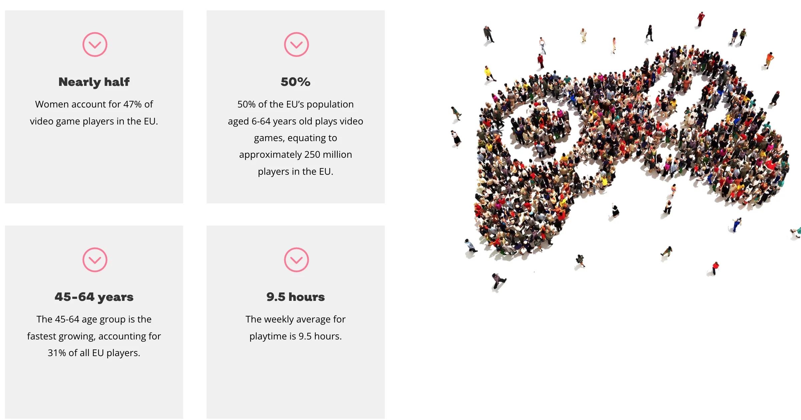

# Videogiochi e Didattica
Alcuni appunti sul tema videogiochi usati in ambito educativo e scolastico

## Introduzione

> si può scoprire di più su una persona in un'ora di gioco che in un anno di conversazione

un gioco è un sistema al cui interno i giocatori scelgono di impegnarsi volontariamente in un conflitto artificiale, ben definito da regole, che porta a un risultato quantificabile.

## 1: Perché usare Videogiochi in classe?

### Skills + Knowledge

Si sviluppano capacità trasversali / soft skills attraverso esperienze coinvolgenti ed immersive

### Cosa serve ai ragazzi per i futuro?
l'attuale e le prossime generazioni necessitano di sviluppare competenze diverse dalla semplice conoscenza di materie base.

- self management
    - focus
    - integrità
    - adattamento
    - iniziativa
- social intelligence
    - comunicazione / linguaggio
    - sensibilità / empatia
    - gestione delle emozioni e dello stress
    - collaborazione / competizione
    - leadership
- innovazione
    - curiosità
    - creatività
- capacità cognitive 
    - problem solving (analisi problema e individuare soluione)
    - prendere buone decisioni
    - pensiero critico, capacità di esaminare situazioni
- etica
    - saper vincere e perdere
    - peer education
    - senso delle cose

**spoiler**: il gioco e il videogioco sviluppa tutte queste

### Imparare giocando

_learn by playing_  
la tecnologia evolve.  
così le idee e i giochi.  

### Playful experience

- Meaningful
- Joyful
- Socially interactive
- Actively engaging
- Iterative

> uno dei problemi più grandi per l'intero settore dell'istruzione ... è quello di tenere gli studenti motivati... I videogames sono coinvolgenti perché l'obiettivo primario dei Game Designers è mantenere vivo l'interesse del giocatore... Mantenere gli utenti coinvolti è un obiettivo che gli educatori non considerano primario. Il loro obiettivo è istruire (Prensky, 2006)

---

I videogiochi garantiscono:

- esperienze personalizzate
- feedback in tempo reale
- forte immedimazione
- contesti sicuri
- reiterazione
- coinvolgimento

### Non tutti i videogiochi sono uguali
Gli effetti dipendono dal tipo di videogioco in uso. Si possono verificare conseguenze a livello cognitivo, emotivo e sociale molto differenti a seconda della tipologia specifica, della fascia di età a cui si riferisce il videogioco e della piattaforma di utilizzo. Ad esempio, un gioco action è in grado di aumentare la capacità di attenzione, mentre i casual game sono molto più efficaci per aiutare i bambini e i ragazzi a rilassarsi. Alcuni videogiochi prevedono un utente più attivo, altri, invece, più passivo; esistono anche videogiochi che possono essere utilizzati per l’apprendimento della grammatica e della storia.

### Domanda: perché volete usare i VideoGiochi a scuola?

### Come impariamo con i giochi?
#### Player flow

#### Competitività
ma non pericolosi

#### Relazioni emotive
con i personaggi

#### Rilevanza culturale e linguaggio comune
i giochi uniscono

#### Play -> Use -> Make
se prima si giocava e basta, ora si _usa_ il gioco per determinati scopi
il prossimo passo sarà aiutare a _creare_.

## 2: Usare i giochi per Apprendere

### Project based learning
un progetto come veicolo per il curriculum
vedi Minecraft o Guitar Hero, Olimpiadi, Star Wars

### COTS (Commercial Off The Shelf)
Molti giochi commerciali si prestano ad essere usati così come sono perché contengono già moltissimi elementi didattici/educativi.

- Nintendo LABO
- Minecraft
- Myst
- Journey
- Age of Empires

## 3: Game Based Learning
### Linguaggio
#### language settings
innanzitutto qualsiasi gioco può cambiare lingua (testo/voiceover)
#### language apps

- Duolingo
- Babbel
- Bravolol

#### Movimento / Exergames
exercise games e kinestetici

- [Just Dance 2019](https://www.ubisoft.com/en-us/game/just-dance-2019/)
- [Run Keeper](https://runkeeper.com/)
- [FitBit](https://www.fitbit.com/home)
- [Google Fit](https://www.google.com/fit/)
- [Zombies, Run!](https://zombiesrungame.com/)

#### AR games

- [Pokémon Go](https://www.pokemongo.com/en-us/)
- [Geocaching](https://www.geocaching.com/play)

### Cognitivi
#### brain training apps

- [Dr Kawashima’s Brain Training](https://www.nintendo.co.uk/Games/Nintendo-DS/Dr-Kawashima-s-Brain-Training-How-Old-is-Your-Brain--270627.html)
- [Mangahigh](https://www.mangahigh.com/en/)
- [Peak Brain Training](https://www.peak.net/)
- [Elevate](https://www.elevateapp.com/)
- [Lumosity](https://www.lumosity.com/en/)
- [Fit Brains](https://five.agency/projects/brain-trainer/)
- [Cognito](https://www.youtube.com/watch?v=-lC_dFOoQ_Q)
- [Sudoku](https://sudoku.game/)

### Simulazione

- [Kerbal Space Academy](https://www.kerbalspaceprogram.com/)
- [Civilization](https://civilization.com)
- [SimCity](https://www.ea.com/games/simcity)
- [Roller Coaster Tycoon Adventures](http://www.rollercoastertycoon.com/adventures/)
- [Farming Simulator 19](https://www.farming-simulator.com/)
- [Train Simulator](https://live.dovetailgames.com/live/train-simulator)
- [Flight Simulator X](https://store.steampowered.com/app/314160/Microsoft_Flight_Simulator_X_Steam_Edition/)
- [Forestry 2019 – The simulation](https://fs19.net/category/farming-simulator-2019-mods/forestry/) 
- [Football Manager 2019](https://store.steampowered.com/app/872790/Football_Manager_2019/)
- [Total War: Rome II](https://www.totalwar.com/games/rome-ii/)
- [Universe Sandbox](http://universesandbox.com/)
- [Stop Disasters!](https://www.stopdisastersgame.org/)

### Siti giochi educativi

- Primary Games Arena - https://primarygamesarena.com/
- Learning Games for Kids - https://learninggamesforkids.com/
- Brain Pop - https://www.brainpop.com/games/game-finder/
  
### Domanda: che gioco useresti?

## 4: Tecnologie nei VG
### AR - Realtà Aumentata
**Augmented reality resources**

- [IKEA video](https://www.youtube.com/watch?v=vDNzTasuYEw) showing their AR app
- [Pokémon Go](https://www.pokemongo.com/en-us/)
- [Harry Potter Wizards Unite](https://www.harrypotterwizardsunite.com/)
- [SpecTrek](https://play.google.com/store/apps/details?id=com.spectrekking.full&hl=en)
- [Seek and Spell](http://www.seeknspell.com/)
- [Google Translate App](https://apps.apple.com/us/app/google-translate/id414706506) with AR feature
- [Quiver](http://www.quivervision.com/)
- [AR Dinopark](https://edshelf.com/tool/ar-dinopark/)
- [Star Walk](https://vitotechnology.com/star-walk.html)
- [HoloLens](https://www.microsoft.com/en-us/hololens)

### VR - Realtù Virtuale
- [Google Cardboard](https://vr.google.com/cardboard/)
- [Google Cardboard Camera](https://vr.google.com/cardboard/apps/)
- [Google Expeditions](https://edu.google.com/products/vr-ar/expeditions/?modal_active=none)
- [Google Cardboard Design Lab](https://vr.google.com/cardboard/developers/)
- [Titans of Space](http://www.titansofspacevr.com/titansofspace.html)
- [YouTube 360](https://www.youtube.com/360)
- [unimersiv](http://unimersiv.com/)

### Gamification
usere elementi dei giochi in altre attività:
- quests
- punti
- livelli
- badge
- rewards
- avatars

#### piattaforme
- classcraft.com
- classdojo.com

#### preparare le missioni (quests)
imparare deve essere come un viaggio

#### provvedere diverse scelte

#### incoraggiare il Mod e l'Hack

#### incoraggiare la collaborazione

#### ridefinire il fallimento
incoraggiare la pratica

#### Leaderboards

#### Easter Eggs

### Premiare la bravura

## 5: Creare Giochi
Perché è importante?

### Creatori, non più consumatori
si diventa creatori, solo creando

Del resto, si può giocare secondo le regole o con le regole, nel senso di costruire un nuovo gioco. La creazione di giochi, quindi, può diventare un’attività educativa capace di innescare atteggiamenti creativi e pensiero computazionale.

### Multidiscipline
i VG sono creazioni multidisciplinari

- coding
- storytelling
- character design
- grafica

deve essere fatta in modo progressivo

### creare una storia interattiva
con Powerpoint

### Intro al coding
introducono al coding in modo visuale

- [Code.org](https://code.org)
- [Scratch Progetti](https://scratch.mit.edu/explore/projects/all)
- [Scratch Ideas](https://scratch.mit.edu/ideas)
- [Scratch Starter Programs](https://scratch.mit.edu/starter-projects)
- [Scratch Jr](https://www.scratchjr.org/teach/activities)

### Minecraft
- [Minecraft](https://minecraft.net/)
- [Minecraft EDU](https://minecraftedu.com/)

### Tools avanzati

- Unity
- RPG Maker

## 6 Il gioco in classe

### Progettazione
Considerare:

- gli obiettivi da perseguire (Es. le competenze da sviluppare o potenziare)
- la metodologia da seguire (Es. gli strumenti disponibili, l’organizzazione del lavoro di classe, il tempo assegnato per ogni sessione di gioco...)
- l’identificazione dei giochi da utilizzare (considerando le meccaniche di gioco e le caratteristiche dell’interfaccia in relazione agli obiettivi da perseguire)
- i possibili effetti sulle prestazioni scolastiche degli studenti, i loro comportamenti e i loro atteggiamenti.

### Selezione dei giochi

- capire come le meccaniche di gioco e le caratteristiche dell’interfaccia (appeal, funzionalità, usabilità) siano funzionali agli obiettivi educativi che si vuole perseguire
- scegliere accuratamente i livelli di difficoltà e la loro progressione
- calibrare in modo appropriato il livello di assistenza da offrire ad ogni studente in modo da attivare il ragionamento e il pensiero strategico e supportare adeguatamente la motivazione e l’impegno
- considerare che, in generale, l’uso dei giochi può rivelarsi utile se non è sporadico e pianificato a breve termine, ma se è incorporato in una progettazione pedagogica che copra un **periodo di tempo medio/lungo**.

### Debrief / Post-gioco
fondamentale

### Spazio
#TODO/img classe_disposizione.png

### Insegnanti ed educatori
> Good teachers use good tools (D. Robertson)

è importante che i giochi proposti siano conosciuti

gli insegnanti devono essere informati non solo sulle potenzialità, le caratteristiche e i limiti di questi strumenti, ma devono anche possedere le capacità necessarie per selezionare giochi appropriati e per progettare e implementare attività di apprendimento

## 7: Perché è importante insegnare i giochi?

### Game Media Literacy

- imparare a conoscere i giochi
- imparare attraverso i giochi e il giocare
- imparare creando giochi
- imparare dai giochi come insegnare

### PEGI e Parental Control

- [PEGI – Pan European Game Information](https://pegi.info/)
- [PEGI - Parental Controls](https://pegi.info/parental-controls)

### Freemium
Free + Premium

### Parlare di videogiochi

- game addiction
- violenza
- social networks
- micropayments
- ads

## Risorse
### Siti di riferimento
- <https://www.isfe.eu/games-in-society/education/>
- European Schoolnet - <http://www.eun.org/>

### Libri per insegnanti
- [Digital Games in School: Handbook for Teachers](http://files.eun.org/Games_in_schools/Gamesinschools_HandbookforTeachers_2020.pdf)
- [The Game Educator’s Handbook](http://storage.eun.org/resources/upload/412/20190429_130609841_412_teaseredition.pdf)
- [Learning though play at school (Lego foundation)](https://www.legofoundation.com/media/1687/learning-through-play-school.pdf)
- [Learning_Education_Games - Karen Schrier](https://www.researchgate.net/publication/321609221_Learning_Education_Games_Volume_2_Bringing_Games_into_Educational_Contexts)
