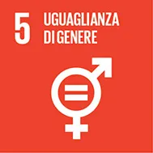
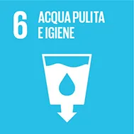
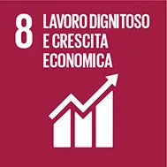
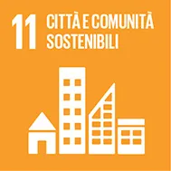
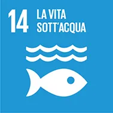
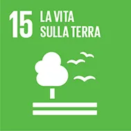
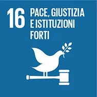

# Agenda 2030 - 17 obiettivi dell'ONU

I 17 obiettivi di sviluppo sostenibile **OSS** (Sustainable Development Goals SDGs) e i 169 sotto-obiettivi ad essi associati costituiscono il nucleo vitale dell’Agenda 2030. Tengono conto in maniera equilibrata delle tre dimensioni dello sviluppo sostenibile, ossia **economica**, **sociale** ed **ecologica**.

## 1: Povertà zero
*Sradicare la povertà in tutte le sue forme e ovunque nel mondo*

Nonostante i notevoli progressi compiuti dagli anni 1990 nella lotta alla povertà, ancora oggi più di 800 milioni di persone – delle quali circa il 70 per cento sono donne – vive in condizioni di estrema indigenza. L’Agenda 2030 per uno sviluppo sostenibile si pone come obiettivo eliminare completamente la povertà estrema entro il 2030. 

Per affrontare il problema della povertà in modo articolato, l’obiettivo 1 comprende, oltre allo sradicamento della povertà estrema, anche un sotto-obiettivo riguardante la povertà relativa, che si rifà alle definizioni nazionali. Le persone povere sono colpite più duramente dalle crisi economiche e politiche, dalla perdita di biodiversità e di servizi ecosistemici, dalle catastrofi naturali e dalla violenza. Al fine di garantire che le persone uscite dalla condizione di povertà non vi ritornino, questo obiettivo prevede anche misure di consolidamento della capacità di resistenza, che comprendono l’istituzione di sistemi di protezione sociale. 

**Obiettivo 1: Sradicare la povertà in tutte le sue forme e ovunque nel mondo**

1.1: Entro il 2030, sradicare la povertà estrema per tutte le persone in tutto il mondo, attualmente misurata sulla base di coloro che vivono con meno di $ 1,25 al giorno

1.2: Entro il 2030, ridurre almeno della metà la quota di uomini, donne e bambini di tutte le età che vivono in povertà in tutte le sue forme, secondo le definizioni nazionali

1.3: Implementare a livello nazionale adeguati sistemi di protezione sociale e misure di sicurezza per tutti, compresi i livelli più bassi, ed entro il 2030 raggiungere una notevole copertura delle persone povere e vulnerabili

1.4: Entro il 2030, assicurare che tutti gli uomini e le donne, in particolare i più poveri e vulnerabili, abbiano uguali diritti alle risorse economiche, insieme all'accesso ai servizi di base, proprietà privata, controllo su terreni e altre forme di proprietà, eredità, risorse naturali, nuove tecnologie appropriate e servizi finanziari, tra cui la microfinanza

1.5: Entro il 2030, rinforzare la resilienza dei poveri e di coloro che si trovano in situazioni di vulnerabilità e ridurre la loro esposizione e vulnerabilità ad eventi climatici estremi, catastrofi e shock economici, sociali e ambientali

1.a: Garantire un’adeguata mobilitazione di risorse da diverse fonti, anche attraverso la cooperazione allo sviluppo, al fine di fornire mezzi adeguati e affidabili per i paesi in via di sviluppo, in particolare i paesi meno sviluppati, attuando programmi e politiche per porre fine alla povertà in tutte le sue forme

1.b: Creare solidi sistemi di politiche a livello nazionale, regionale e internazionale, basati su strategie di sviluppo a favore dei poveri e sensibili alle differenze di genere, per sostenere investimenti accelerati nelle azioni di lotta alla povertà

---

## 2: Fame zero
*Porre fine alla fame, raggiungere la sicurezza alimentare, migliorare l’alimentazione e promuovere l’agricoltura sostenibile.*

Benché la situazione sia migliorata in molti Paesi, nel mondo sono ancora numerose le persone che patiscono la fame o soffrono di malnutrizione. A livello mondiale la denutrizione colpisce quasi 800 milioni di persone, in particolare donne e bambini. L’Agenda 2030 si pone come obiettivo sradicare la fame e tutte le forme di malnutrizione ovunque nel mondo nei prossimi 15 anni. A causa del rapido incremento della domanda di alimenti a livello mondiale, si stima che la loro produzione dovrà essere più che raddoppiata entro il 2050. Circa il 70 per cento delle persone denutrite dipende, in modo diretto o indiretto, dall’agricoltura per la propria sopravvivenza: sono infatti proprio i piccoli agricoltori a correre il rischio di denutrizione. 

Oltre all’eliminazione della fame, l’obiettivo 2 comprende anche un sotto-obiettivo che si prefigge di sradicare la malnutrizione in tutte le sue forme. La qualità dell’alimentazione è infatti importante tanto quanto la quantità. L’obiettivo comprende inoltre aspetti economici, tra cui il raddoppiamento della produttività agricola e del reddito dei piccoli agricoltori entro il 2030. Affinché l’incremento della produzione alimentare non vada a scapito dell’ambiente, l’obiettivo 2 comprende anche istruzioni volte a garantire un’agricoltura sostenibile. 

2.1: Entro il 2030, porre fine alla fame e garantire a tutte le persone, in particolare ai poveri e le persone più vulnerabili, tra cui neonati, un accesso sicuro a cibo nutriente e sufficiente per tutto l'anno

2.2: Entro il 2030, porre fine a tutte le forme di malnutrizione; raggiungere, entro il 2025, i traguardi concordati a livello internazionale contro l’arresto della crescita e il deperimento nei bambini sotto i 5 anni di età; soddisfare le esigenze nutrizionali di ragazze adolescenti, donne in gravidanza e allattamento e le persone anziane

2.3: Entro il 2030, raddoppiare la produttività agricola e il reddito dei produttori di cibo su piccola scala, in particolare le donne, i popoli indigeni, le famiglie di agricoltori, i pastori e i pescatori, anche attraverso un accesso sicuro ed equo a terreni, altre risorse e input produttivi, conoscenze, servizi finanziari, mercati e opportunità per valore aggiunto e occupazioni non agricole

2.4: Entro il 2030, garantire sistemi di produzione alimentare sostenibili e implementare pratiche agricole resilienti che aumentino la produttività e la produzione, che aiutino a proteggere gli ecosistemi, che rafforzino la capacità di adattamento ai cambiamenti climatici, a condizioni meteorologiche estreme, siccità, inondazioni e altri disastri e che migliorino progressivamente la qualità del suolo

2.5: Entro il 2020, mantenere la diversità genetica delle sementi, delle piante coltivate, degli animali da allevamento e domestici e delle specie selvatiche affini, anche attraverso banche di semi e piante diversificate e opportunamente gestite a livello nazionale, regionale e internazionale; promuovere l'accesso e la giusta ed equa ripartizione dei benefici derivanti dall'utilizzo delle risorse genetiche e della conoscenza tradizionale associata, come concordato a livello internazionale

2.a: Aumentare gli investimenti, anche attraverso il miglioramento della cooperazione internazionale, in infrastrutture rurali, ricerca agricola e formazione, sviluppo tecnologico e le banche di geni vegetali e animali, al fine di migliorare la capacità produttiva agricola nei paesi in via di sviluppo, in particolare i paesi meno sviluppati

2.b: Correggere e prevenire restrizioni commerciali e distorsioni nei mercati agricoli mondiali, anche attraverso l'eliminazione parallela di tutte le forme di sovvenzioni alle esportazioni agricole e di tutte le misure di esportazione con effetto equivalente, conformemente al mandato del Doha Development Round

2.c: Adottare misure per garantire il corretto funzionamento dei mercati delle materie prime alimentari e loro derivati e facilitare l'accesso rapido alle informazioni di mercato, incluse le riserve di cibo, al fine di contribuire a limitare l’instabilità estrema dei prezzi dei beni alimentari

---

## 3: Salute e benessere
*Garantire una vita sana e promuovere il benessere di tutti a tutte le età*

Gli OSM hanno contribuito in modo significativo a migliorare la salute a livello globale, sostenendo la lotta contro malattie come l’AIDS, la tubercolosi e la malaria. Dal 2000 i decessi dovuti alla malaria sono diminuiti, per esempio, del 60 per cento. Tuttavia, in molti ambiti i risultati sono ancora inferiori alle aspettative, come nella riduzione del tasso di mortalità infantile e materna. 

L’esperienza fatta con gli OSM insegna che le questioni sanitarie non vanno considerate singolarmente, ma con una visione d’insieme. È attestato che l’istruzione e la sicurezza alimentare incidono sul successo dei programmi in ambito sanitario. L’obiettivo 3, oltre a portare avanti gli sforzi degli OSM per quanto concerne la mortalità infantile e materna e le malattie trasmissibili come AIDS, malaria e tubercolosi, comprende anche istruzioni per la lotta contro le malattie non trasmissibili, come il diabete, nonché per la prevenzione di incidenti stradali e l’abuso di sostanze stupefacenti. Tutti dovrebbero avere accesso a servizi sanitari e farmaci di buon livello ed essere protetti da rischi finanziari. Entro il 2030 dovrà inoltre essere garantito l’accesso alle cure nell’ambito delle malattie sessuali e della medicina riproduttiva, compresi servizi come pianificazione familiare, informazioni ed educazione in merito a queste tematiche. 

3.1: Entro il 2030, ridurre il tasso di mortalità materna globale a meno di 70 per ogni 100.000 bambini nati vivi

3.2: Entro il 2030, porre fine alle morti prevenibili di neonati e bambini sotto i 5 anni di età.  Tutti i paesi dovranno cercare di ridurre la mortalità neonatale ad almeno 12 per ogni 1.000 bambini nati vivi e la mortalità dei bambini sotto i 5 anni di età ad almeno 25 per 1.000 bambini nati vivi

3.3: Entro il 2030, porre fine alle epidemie di AIDS, tubercolosi, malaria e malattie tropicali trascurate; combattere l'epatite, le malattie di origine idrica e le altre malattie trasmissibili

3.4: Entro il 2030, ridurre di un terzo la mortalità prematura da malattie non trasmissibili attraverso la prevenzione e il trattamento e promuovere benessere e salute mentale

3.5: Rafforzare la prevenzione e il trattamento di abuso di sostanze, tra cui l’abuso di stupefacenti e il consumo nocivo di alcol

3.6: Entro il 2020, dimezzare il numero globale di morti e feriti a seguito di incidenti stradali

3.7: Entro il 2030, garantire l'accesso universale ai servizi di assistenza sanitaria sessuale e riproduttiva, inclusa la pianificazione familiare, l'informazione, l'educazione e l'integrazione della salute riproduttiva nelle strategie e nei programmi nazionali

3.8: Conseguire una copertura sanitaria universale, compresa la protezione da rischi finanziari, l'accesso ai servizi essenziali di assistenza sanitaria di qualità e l’accesso sicuro, efficace, di qualità e a prezzi accessibili a medicinali di base e vaccini per tutti

3.9: Entro il 2030, ridurre sostanzialmente il numero di decessi e malattie da sostanze chimiche pericolose e da contaminazione e inquinamento dell’aria, delle acque e del suolo

3.a: Rafforzare l'attuazione del Quadro Normativo della Convenzione dell’Organizzazione Mondiale della Sanità sul Controllo del Tabacco in modo appropriato in tutti i paesi

3.b: Sostenere la ricerca e lo sviluppo di vaccini e farmaci per le malattie trasmissibili e non trasmissibili che colpiscono soprattutto i paesi in via di sviluppo; fornire l'accesso a farmaci e vaccini essenziali ed economici, in conformità alla Dichiarazione di Doha sull'Accordo TRIPS e la Sanità Pubblica, che afferma il diritto dei paesi in via di sviluppo ad utilizzare appieno le disposizioni dell'Accordo sugli Aspetti Commerciali dei Diritti di Proprietà Intellettuali contenenti le cosiddette “flessibilità” per proteggere la sanità pubblica e, in particolare, fornire l'accesso a farmaci per tutti

3.c: Aumentare considerevolmente i fondi destinati alla sanità e alla selezione, formazione, sviluppo e mantenimento del personale sanitario nei paesi in via di sviluppo, specialmente nei meno sviluppati e nei piccoli Stati insulari in via di sviluppo

3.d: Rafforzare la capacità di tutti i Paesi, soprattutto dei Paesi in via di sviluppo, di segnalare in anticipo, ridurre e gestire i rischi legati alla salute, sia a livello nazionale che globale.

---

## 4: Istruzione di qualità
*Garantire un’istruzione di qualità inclusiva ed equa e promuovere opportunità di apprendimento continuo per tutti.*

La comunità internazionale ricorda l’importanza di un’istruzione e di una formazione di qualità per migliorare le condizioni di vita delle persone, delle comunità e delle società. Forte degli insegnamenti tratti dagli Obiettivi di Sviluppo del Millennio (OSM), l’obiettivo 4 non si limita all’istruzione primaria dei bambini, ma si concentra anche sul punto di contatto tra istruzione di base e formazione professionale. Pone inoltre l’accento sull’equità e sulla qualità dell’istruzione in un’ottica di apprendimento che si estenda lungo tutto l’arco della vita, due dimensioni trascurate dagli OSM. 

L’obiettivo 4 mira a garantire che tutti i bambini, i giovani e gli adulti, in particolar modo i più emarginati e vulnerabili, possano accedere a un’istruzione e a una formazione adeguate alle loro esigenze e al contesto in cui vivono. L’istruzione contribuisce infatti a creare un mondo più sicuro, sostenibile e interdipendente. 

Rispetto ad altri Paesi, la Svizzera vanta una struttura particolarmente avanzata, sia dal punto di vista della formazione professionale (sistema duale) sia per quanto concerne l’istruzione di base (governance decentralizzata, sistema-passerella, bilinguismo). Attraverso i suoi aiuti, la DSC lavora a favore dell’accesso a un’istruzione di qualità per tutti e rinsalda il legame tra istruzione di base, formazione professionale e integrazione socioprofessionale con l’obiettivo di migliorare, in prospettiva, lo sviluppo economico e sociale. 

**Obiettivo 4: Garantire un’istruzione di qualità inclusiva ed equa e promuovere opportunità di apprendimento continuo per tutti**

4.1: Garantire entro il 2030 ad ogni ragazza e ragazzo libertà, equità e qualità nel completamento dell'educazione primaria e secondaria che porti a risultati di apprendimento adeguati e concreti

4.2: Garantire entro il 2030 che ogni ragazza e ragazzo abbiano uno sviluppo infantile di qualità, ed un accesso a cure ed istruzione pre-scolastiche così da essere pronti alla scuola primaria

4.3: Garantire entro il 2030 ad ogni donna e uomo un accesso equo ad un’istruzione tecnica, professionale e terziaria -anche universitaria- che sia economicamente vantaggiosa e di qualità

4.4: Aumentare considerevolmente entro il 2030 il numero di giovani e adulti con competenze specifiche -anche tecniche e professionali- per l’occupazione, posti di lavoro dignitosi e per l’imprenditoria

4.5: Eliminare entro il 2030 le disparità di genere nell'istruzione e garantire un accesso equo a tutti i livelli di istruzione e formazione professionale delle categorie protette, tra cui le persone con disabilità, le popolazioni indigene ed i bambini in situazioni di vulnerabilità

4.6: Garantire entro il 2030 che tutti i giovani e gran parte degli adulti, sia uomini che donne, abbiano un livello di alfabetizzazione ed una capacità di calcolo

4.7: Garantire entro il 2030 che tutti i discenti acquisiscano la conoscenza e le competenze necessarie a promuovere lo sviluppo sostenibile, anche tramite un educazione volta ad uno sviluppo e uno stile di vita sostenibile, ai diritti umani, alla parità di genere, alla promozione di una cultura pacifica e non violenta, alla cittadinanza globale e alla valorizzazione delle diversità culturali e del contributo della cultura allo sviluppo sostenibile

4.a: Costruire e potenziare le strutture dell'istruzione che siano sensibili ai bisogni dell'infanzia, alle disabilità e alla parità di genere e predisporre ambienti dedicati all'apprendimento che siano sicuri, non violenti e inclusivi per tutti

4.b: Espandere considerevolmente entro il 2020 a livello globale il numero di borse di studio disponibili per i paesi in via di sviluppo, specialmente nei paesi meno sviluppati, nei piccoli stati insulari e negli stati africani, per garantire l'accesso all'istruzione superiore  - compresa la formazione professionale, le tecnologie dell'informazione e della comunicazione e i programmi tecnici, ingegneristici e scientifici -  sia nei paesi sviluppati che in quelli in via di sviluppo

4.c: Aumentare considerevolmente entro il 2030 la presenza di insegnanti qualificati, anche grazie alla cooperazione internazionale, per la loro attività di formazione negli stati in via di sviluppo, specialmente nei paesi meno sviluppati e i piccoli stati insulari in via di sviluppo

---

## 5: Uguaglianza di genere
*Raggiungere l’uguaglianza di genere e l’autodeterminazione di tutte le donne e ragazze.*

Le disparità di genere costituiscono uno dei maggiori ostacoli allo sviluppo sostenibile, alla crescita economica e alla lotta contro la povertà. L’OSM 3 per promuovere l’uguaglianza di genere e l’empowerment delle donne ha consentito di fare significativi progressi nella scolarizzazione delle ragazze e nell’inserimento delle donne nel mercato del lavoro. Il tema della parità dei sessi ha ottenuto una notevole visibilità ma, considerato il quadro molto circoscritto dell’OSM 3, non è stato possibile affrontare altre tematiche importanti, come la violenza sulle donne, le disparità economiche e la scarsa presenza delle donne negli organismi decisionali a livello politico. 

L’obiettivo 5 mira a ottenere la parità di opportunità tra donne e uomini nello sviluppo economico, l’eliminazione di tutte le forme di violenza nei confronti di donne e ragazze (compresa l’abolizione dei matrimoni forzati e precoci) e l’uguaglianza di diritti a tutti i livelli di partecipazione. 

5.1: Porre fine, ovunque, a ogni forma di discriminazione nei confronti di donne e ragazze

5.2: Eliminare ogni forma di violenza nei confronti di donne e bambine, sia nella sfera privata che in quella pubblica, compreso il traffico di donne e lo sfruttamento sessuale e di ogni altro tipo

5.3: Eliminare ogni pratica abusiva come il matrimonio combinato, il fenomeno delle spose bambine e le mutilazioni genitali femminili

5.4: Riconoscere e valorizzare la cura e il lavoro domestico non retribuito, fornendo un servizio pubblico, infrastrutture e politiche di protezione sociale e la promozione di responsabilità condivise all'interno delle famiglie, conformemente agli standard nazionali

5.5: Garantire piena ed effettiva partecipazione femminile e pari opportunità di leadership ad ogni livello decisionale in ambito politico, economico e della vita pubblica

5.6: Garantire accesso universale alla salute sessuale e riproduttiva e ai diritti in ambito riproduttivo, come concordato nel Programma d'Azione della Conferenza internazionale su popolazione e sviluppo e dalla Piattaforma d'Azione di Pechino e dai documenti prodotti nelle successive conferenze

5.a: Avviare riforme per dare alle donne uguali diritti di accesso alle risorse economiche così come alla titolarità e al controllo della terra e altre forme di proprietà, ai servizi finanziari, eredità e risorse naturali, in conformità con le leggi nazionali

5.b: Rafforzare l'utilizzo di tecnologie abilitanti, in particolare le tecnologie dell'informazione e della comunicazione, per promuovere l'emancipazione della donna

5.c: Adottare e intensificare una politica sana ed una legislazione applicabile per la promozione della parità di genere e l'emancipazione di tutte le donne e bambine, a tutti i livelli

---

## 6: Acqua pulita e igiene
*Garantire la disponibilità e la gestione sostenibile di acqua e servizi igienici per tutti*

L’accesso all’acqua potabile e ai servizi igienici di base è un diritto umano e, insieme all’acqua come risorsa, rappresenta un fattore determinante per tutti gli aspetti dello sviluppo sociale, economico e ambientale. Sebbene i target relativi all’acqua potabile e ai servizi igienici siano stati integrati negli Obiettivi di Sviluppo del Millennio (OSM), altri aspetti cruciali per lo sviluppo sostenibile, come la gestione delle risorse idriche, lo smaltimento delle acque reflue, la qualità dell’acqua e la riduzione della vulnerabilità nei confronti delle catastrofi legate all’acqua non sono stati affrontati nell’ambito degli OSM. 

L’obiettivo 6 comprende pertanto, oltre all’accesso all’acqua potabile e ai servizi igienico-sanitari, anche ulteriori sotto-obiettivi, per esempio per la protezione e la riabilitazione di ecosistemi legati all’acqua (tra cui montagne, foreste, zone umide, fiumi e laghi). La qualità dell’acqua dovrà migliorare e l’inquinamento idrico essere ridotto, soprattutto quello generato da prodotti chimici pericolosi. La cooperazione transfrontaliera sarà incentivata al fine di pervenire a una gestione integrata delle risorse idriche a tutti i livelli. 

6.1: Ottenere entro il 2030 l’accesso universale ed equo all'acqua potabile che sia sicura ed economica per tutti

6.2: Ottenere entro il 2030 l'accesso ad impianti sanitari e igienici adeguati ed equi per tutti e porre fine alla defecazione all'aperto, prestando particolare attenzione ai bisogni di donne e bambine e a chi si trova in situazioni di vulnerabilità

6.3: Migliorare entro il 2030 la qualità dell'acqua eliminando le discariche, riducendo l'inquinamento e il rilascio di prodotti chimici e scorie pericolose, dimezzando la quantità di acque reflue non trattate e aumentando considerevolmente il riciclaggio e il reimpiego sicuro a livello globale

6.4: Aumentare considerevolmente entro il 2030 l'efficienza nell'utilizzo dell'acqua in ogni settore e garantire approvvigionamenti e forniture sostenibili di acqua potabile, per affrontare la carenza idrica e ridurre in modo sostanzioso il numero di persone che ne subisce le conseguenze

6.5: Implementare entro il 2030 una gestione delle risorse idriche integrata a tutti i livelli, anche tramite la cooperazione transfrontaliera, in modo appropriato

6.6: Proteggere e risanare entro il 2030 gli ecosistemi legati all'acqua, comprese le montagne, le foreste, le paludi, i fiumi, le falde acquifere e i laghi

6.a: Espandere entro il 2030 la cooperazione internazionale e il supporto per creare attività e programmi legati all'acqua e agli impianti igienici nei paesi in via di sviluppo, compresa la raccolta d'acqua, la desalinizzazione, l'efficienza idrica, il trattamento delle acque reflue e le tecnologie di riciclaggio e reimpiego

6.b: Supportare e rafforzare la partecipazione delle comunità locali nel miglioramento della gestione dell'acqua e degli impianti igienici

---

## 7: Energia pulita e accessibile
*Garantire l’accesso all’energia a prezzo accessibile, affidabile, sostenibile e moderna per tutti*

L’accesso all’energia è un presupposto imprescindibile per la realizzazione di molti obiettivi di sviluppo sostenibile che esulano dal settore energetico, come l’eliminazione della povertà, l’incremento della produzione di derrate alimentari, l’accesso ad acqua pulita, il miglioramento della salute pubblica, l’ampliamento della formazione, l’incentivazione dell’economia e la promozione delle donne. Ad oggi 1,6 miliardi di persone nel mondo non hanno accesso all’elettricità e 2,5 miliardi di persone dipendono dalla biomassa tradizionale come fonte di energia. 

L’obiettivo 7 sostiene pertanto l’accesso di tutti a servizi di approvvigionamento energetico affidabili, moderni ed economicamente accessibili. Dal momento che uno sviluppo sostenibile si fonda su presupposti di sviluppo economico rispettosi dell’ambiente, la quota di energie rinnovabili nel mix energetico globale dovrà essere nettamente aumentata e il tasso di incremento dell’efficienza energetica a livello mondiale dovrà essere raddoppiato. La ricerca nei settori delle energie rinnovabili e dell’efficienza energetica sarà incentivata, così come gli investimenti nell’infrastruttura e in tecnologie energetiche pulite. 

7.1: Garantire entro il 2030 accesso a servizi energetici che siano convenienti, affidabili e moderni

7.2: Aumentare considerevolmente entro il 2030 la quota di energie rinnovabili nel consumo totale di energia

7.3: Raddoppiare entro il 2030 il tasso globale di miglioramento dell’efficienza energetica

7.a: Accrescere entro il 2030 la cooperazione internazionale per facilitare l’accesso alla ricerca e alle tecnologie legate all’energia pulita - comprese le risorse rinnovabili, l’efficienza energetica e le tecnologie di combustibili fossili più avanzate e pulite - e promuovere gli investimenti nelle infrastrutture energetiche e nelle tecnologie dell’energia pulita

7.b  Implementare entro il 2030 le infrastrutture e migliorare le tecnologie per fornire servizi energetici moderni e sostenibili, specialmente nei paesi meno sviluppati, nei piccoli stati insulari e negli stati in via di sviluppo senza sbocco sul mare, conformemente ai loro rispettivi programmi di sostegno

---

## 8: Lavoro dignitoso e crescita economica
*Promuovere una crescita economica duratura, inclusiva e sostenibile, la piena occupazione e il lavoro dignitoso per tutti*

Secondo i dati attuali, nel mondo sono più di 200 milioni le persone senza fonte di guadagno, soprattutto giovani. Lavoro e crescita economica contribuiscono in modo determinante a debellare la povertà. La promozione di una crescita sostenibile e di un’economia verde nonché la creazione di un numero sufficiente di posti di lavoro dignitosi, congiuntamente al rispetto dei diritti dell’uomo e dei limiti del nostro Pianeta, hanno un’importanza cruciale sia per i Paesi in via di sviluppo sia per quelli emergenti e industrializzati. 

L’obiettivo 8 comprende sotto-obiettivi concernenti la crescita economica, l’aumento della produttività e la creazione di posti di lavoro dignitosi. Il lavoro forzato deve essere contrastato e i fenomeni della schiavitù moderna e della tratta di esseri umani dovranno essere sradicati entro il 2030. Una crescita economica sostenibile non può inoltre avvenire a scapito dell’ambiente. L’obiettivo 8 esige pertanto il miglioramento, a livello mondiale, dell’efficienza nell’uso delle risorse nel consumo e nella produzione e persegue il disaccoppiamento della crescita economica dal degrado ambientale. 

8.1: Sostenere la crescita economica pro capite in conformità alle condizioni nazionali, e in particolare una crescita annua almeno del 7% del prodotto interno lordo nei paesi in via di sviluppo

8.2: Raggiungere standard più alti di produttività economica attraverso la diversificazione, il progresso tecnologico e l’innovazione, anche con particolare attenzione all’alto valore aggiunto e ai settori ad elevata intensità di lavoro

8.3: Promuovere politiche orientate allo sviluppo, che supportino le attività produttive, la creazione di posti di lavoro dignitosi, l’imprenditoria, la creatività e l’innovazione, e che incoraggino la formalizzazione e la crescita delle piccole-medie imprese, anche attraverso l’accesso a servizi finanziari

8.4: Migliorare progressivamente, entro il 2030, l’efficienza globale nel consumo e nella produzione di risorse e tentare di scollegare la crescita economica dalla degradazione ambientale, conformemente al Quadro decennale di programmi relativi alla produzione e al consumo sostenibile, con i paesi più sviluppati in prima linea

8.5: Garantire entro il 2030 un’occupazione piena e produttiva e un lavoro dignitoso per donne e uomini, compresi i giovani e le persone con disabilità, e un’equa remunerazione per lavori di equo valore

8.6: Ridurre entro il 2030 la quota di giovani disoccupati e al di fuori di ogni ciclo di studio o formazione

8.7: Prendere provvedimenti immediati ed effettivi per sradicare il lavoro forzato, porre fine alla schiavitù moderna e alla tratta di esseri umani e garantire la proibizione ed eliminazione delle peggiori forme di lavoro minorile, compreso il reclutamento e l’impiego dei bambini soldato, nonché porre fine entro il 2025 al lavoro minorile in ogni sua forma

8.8: Proteggere il diritto al lavoro e promuovere un ambiente lavorativo sano e sicuro per tutti i lavoratori, inclusi gli immigrati, in particolare le donne, e i precari

8.9: Concepire e implementare entro il 2030 politiche per favorire un turismo sostenibile che crei lavoro e promuova la cultura e i prodotti locali

8.10: Rafforzare la capacità degli istituti finanziari interni per incoraggiare e aumentare l’utilizzo di servizi bancari, assicurativi e finanziari per tutti

8.a: Aumentare il supporto dell’aiuto per il commercio per i paesi in via di sviluppo, in particolare i meno sviluppati, anche tramite il Quadro Integrato Rafforzato per l’assistenza tecnica legata agli scambi dei paesi meno sviluppati

8.b: Sviluppare e rendere operativa entro il 2020 una strategia globale per l’occupazione giovanile e implementare il Patto Globale per l’Occupazione dell’Organizzazione Internazionale del Lavoro

---

## 9: Industria, innovazione e infrastrutture
*Costruire un’infrastruttura resiliente, promuovere l’industrializzazione inclusiva e sostenibile e sostenere l’innovazione*

Gli investimenti in un’infrastruttura sostenibile e nella ricerca scientifica e tecnologica favoriscono la crescita economica, creano posti di lavoro e promuovono il benessere. Nei prossimi 15 anni, soprattutto nei Paesi emergenti e in via di sviluppo, dovranno essere realizzati progetti infrastrutturali per importi miliardari. L’obiettivo 9 mira pertanto a costruire un’infrastruttura resiliente, a promuovere l’industrializzazione inclusiva e sostenibile e a sostenere l’innovazione.

Per rendere sostenibili le infrastrutture e le industrie, entro il 2030 le risorse dovranno essere impiegate in modo più efficiente e si dovranno incentivare tecnologie e processi industriali puliti e rispettosi dell’ambiente. Lo sviluppo tecnologico, la ricerca e l’innovazione dovranno essere sostenuti in particolare nei Paesi in via di sviluppo. Inoltre, dovrà essere favorito l’accesso di industrie e di altre imprese di piccole dimensioni ai servizi finanziari, compresi i crediti a condizioni vantaggiose, e si dovrà incrementare la loro integrazione nei mercati e nelle catene di creazione di valore. Infine, nei Paesi meno sviluppati, l’accesso a Internet dovrà essere semplice e diffuso.

9.1: Sviluppare infrastrutture di qualità, affidabili, sostenibili e resilienti – comprese quelle regionali e transfrontaliere – per supportare lo sviluppo economico e il benessere degli individui, con particolare attenzione ad un accesso equo e conveniente per tutti

9.2: Promuovere un'industrializzazione inclusiva e sostenibile e aumentare significativamente, entro il 2030, le quote di occupazione nell'industria e il prodotto interno lordo, in linea con il contesto nazionale, e raddoppiare questa quota nei paesi meno sviluppati

9.3: Incrementare l'accesso delle piccole imprese industriali e non, in particolare nei paesi in via di sviluppo, ai servizi finanziari, compresi i prestiti a prezzi convenienti, e la loro integrazione nell'indotto e nei mercati

9.4: Migliorare entro il 2030 le infrastrutture e riconfigurare in modo sostenibile le industrie, aumentando l'efficienza nell'utilizzo delle risorse e adottando tecnologie e processi industriali più puliti e sani per l'ambiente, facendo sì che tutti gli stati si mettano in azione nel rispetto delle loro rispettive capacità

9.5: Aumentare la ricerca scientifica, migliorare le capacità tecnologiche del settore industriale in tutti gli stati – in particolare in quelli in via di sviluppo – nonché incoraggiare le innovazioni e incrementare considerevolmente, entro il 2030, il numero di impiegati per ogni milione di persone, nel settore della ricerca e dello sviluppo e la spesa per la ricerca – sia pubblica che privata – e per lo sviluppo

9.a: Facilitare lo formazione di infrastrutture sostenibili e resilienti negli stati in via di sviluppo tramite un supporto finanziario, tecnico e tecnologico rinforzato per i paesi africani, i paesi meno sviluppati, quelli senza sbocchi sul mare e i piccoli Stati insulari in via di sviluppo

9.b: Supportare lo sviluppo tecnologico interno, la ricerca e l'innovazione nei paesi in via di sviluppo, anche garantendo una politica ambientale favorevole, inter alia, per una diversificazione industriale e un valore aggiunto ai prodotti

9.c: Aumentare in modo significativo l’accesso alle tecnologie di informazione e comunicazione e impegnarsi per fornire ai paesi meno sviluppati un accesso a Internet universale ed economico entro il 2020

---

## 10: Ridurre le disuguaglianze
*Ridurre le disuguaglianze all’interno dei e fra i Paesi*

Le disuguaglianze globali sono molto ampie e rappresentano uno dei maggiori ostacoli allo sviluppo sostenibile e alla lotta contro la povertà. Negli ultimi anni in molti Paesi le disuguaglianze sono aumentate. Esse limitano le possibilità di alcuni settori della società di partecipare alla vita sociale, culturale, politica ed economica e di apportare un contributo utile. Pertanto l’obiettivo 10 è incentrato sulla riduzione delle disuguaglianze all’interno degli Stati e tra gli Stati stessi.

Concretamente, l’obiettivo 10 esige che il tasso di crescita del reddito del 40 per cento della popolazione più povera sia incrementato in modo durevole. Inoltre, entro il 2030 tutti dovranno avere diritto all’empowerment e l’inclusione sociale, economica e politica dovrà essere promossa. Le pari opportunità dovranno essere garantite eliminando leggi, politiche e pratiche discriminatorie. Dovranno essere agevolate una migrazione e una mobilità ordinate e sicure, tra l’altro mediante una politica responsabile in materia di migrazione. I Paesi in via di sviluppo dovranno godere di una rappresentanza migliore nelle istituzioni economiche e finanziarie internazionali e avere maggiori opportunità di esprimere il proprio parere nei processi decisionali.

10.1: Entro il 2030, raggiungere progressivamente e sostenere la crescita del reddito del 40% della popolazione nello strato sociale piùbasso ad un tasso superiore rispetto alla media nazionale

10.2: Entro il 2030, potenziare e promuovere l’inclusione sociale, economica e politica di tutti, a prescindere da età, sesso, disabilità, razza, etnia, origine, religione, stato economico o altro

10.3: Assicurare pari opportunità e ridurre le disuguaglianze nei risultati, anche eliminando leggi, politiche e pratiche discriminatorie e promuovendo legislazioni, politiche e azioni appropriate a tale proposito

10.4: Adottare politiche, in particolare fiscali, salariali e di protezione sociale, per raggiungere progressivamente una maggior uguaglianza

10.5: Migliorare la regolamentazione e il monitoraggio di istituzioni e mercati finanziari globali e rafforzare l’attuazione di tali norme

10.6: Assicurare una migliore rappresentanza che dia voce ai paesi in via di sviluppo nelle istituzioni responsabili delle decisioni in materia di economia e finanza globale e internazionale, per creare istituzioni più efficaci, credibili, responsabili e legittimate

10.7: Rendere più disciplinate, sicure, regolari e responsabili la migrazione e la mobilità delle persone, anche con l’attuazione di politiche migratorie pianificate e ben gestite

10.a: Attuare il principio del trattamento speciale e differente riservato ai paesi in via di sviluppo, in particolare ai meno sviluppati, in conformità agli accordi dell’Organizzazione Mondiale del Commercio

10.b: Incoraggiare l’aiuto pubblico allo sviluppo e i flussi finanziari, compresi gli investimenti diretti esteri, per gli stati più bisognosi, in particolar modo i paesi meno sviluppati, i paesi africani, i piccoli stati insulari in via di sviluppo e i paesi in via di sviluppo senza sbocco al mare, in conformità ai loro piani e programmi nazionali

10.c: Entro il 2030, ridurre a meno del 3% i costi di transazione delle rimesse dei migranti ed eliminare i corridoi di rimesse con costi oltre il 5%

---

## 11: Città e comunità sostenibili
*Rendere le città e gli insediamenti umani inclusivi, sicuri, resilienti e sostenibili*

L’urbanizzazione è uno degli sviluppi più significativi del 21° secolo. Più della metà della popolazione mondiale vive nelle città, con stime fino al 70 per cento per il 2050. Le città sono il motore delle economie locali e nazionali e rappresentano il fulcro del benessere. Più dell’80 per cento delle attività economiche globali è concentrato nei centri urbani. Oltre alle opportunità, l’urbanizzazione comporta anche notevoli sfide. Le città hanno un’impronta ecologica enorme: occupano solamente circa tre per cento della superficie terrestre, ma consumano tre quarti delle risorse globali e sono responsabili del 75 per cento delle emissioni di gas.

L’obiettivo 11 mira a ridurre l’inquinamento pro capite prodotto dalle città, in particolare per quanto concerne la qualità dell’aria e la gestione dei rifiuti. Lo sviluppo urbano dovrà essere più inclusivo e sostenibile, tra l’altro grazie a una pianificazione degli insediamenti partecipativa, integrata e sostenibile. Dovrà altresì essere garantito l’accesso di tutti a superfici verdi e spazi pubblici sicuri e inclusivi, soprattutto per donne e bambini, anziani e persone con disabilità. Dovrà infine essere assicurato anche l’accesso a spazi abitativi e sistemi di trasporti sicuri ed economici.

11.1: Entro il 2030, garantire a tutti l’accesso ad alloggi adeguati, sicuri e convenienti e ai servizi di base e riqualificare i quartieri poveri

11.2: Entro il 2030, garantire a tutti l’accesso a un sistema di trasporti sicuro, conveniente, accessibile e sostenibile, migliorando la sicurezza delle strade, in particolar modo potenziando i trasporti pubblici, con particolare attenzione ai bisogni di coloro che sono più vulnerabili, donne, bambini, persone con invalidità e anziani

11.3: Entro il 2030, potenziare un’urbanizzazione inclusiva e sostenibile e la capacità di pianificare e gestire in tutti i paesi un insediamento umano che sia partecipativo, integrato e sostenibile

11.4: Potenziare gli sforzi per proteggere e salvaguardare il patrimonio culturale e naturale del mondo

11.5: Entro il 2030, ridurre in modo significativo il numero di decessi e il numero di persone colpite e diminuire in modo sostanziale le perdite economiche dirette rispetto al prodotto interno lordo globale causate da calamità, comprese quelle legate all’acqua, con particolare riguardo alla protezione dei poveri e delle persone più vulnerabili

11.6: Entro il 2030, ridurre l’impatto ambientale negativo pro-capite delle città, prestando particolare attenzione alla qualità dell’aria e alla gestione dei rifiuti urbani e di altri rifiuti

11.7: Entro il 2030, fornire accesso universale a spazi verdi e pubblici sicuri, inclusivi e accessibili, in particolare per donne, bambini, anziani e disabili

11.a: Supportare i positivi legami economici, sociali e ambientali tra aree urbane, periurbane e rurali rafforzando la pianificazione dello sviluppo nazionale e regionale

11.b: Entro il 2020, aumentare considerevolmente il numero di città e insediamenti umani che adottano e attuano politiche integrate e piani tesi all’inclusione, all’efficienza delle risorse, alla mitigazione e all’adattamento ai cambiamenti climatici, alla resistenza ai disastri, e che promuovono e attuano una gestione olistica del rischio di disastri su tutti i livelli, in linea con il Quadro di Sendai per la Riduzione del Rischio di Disastri 2015-2030

11.c: Supportare i paesi meno sviluppati, anche con assistenza tecnica e finanziaria, nel costruire edifici sostenibili e resilienti utilizzando materiali locali

---

## 12: Consumo e produzione responsabili
*Garantire modelli di consumo e produzione sostenibili*

Ad oggi le risorse consumate dalla popolazione mondiale sono più di quelle che gli ecosistemi sono in grado di fornire. Affinché lo sviluppo sociale ed economico possa avvenire in un quadro di sostenibilità, la nostra società dovrà modificare in modo radicale il proprio modo di produrre e consumare beni.

L’obiettivo 12 promuove l’attuazione del programma decennale dell’ONU per un modello di consumo e di produzione sostenibile. L’obiettivo è adottare un approccio rispettoso dell’ambiente ai prodotti chimici e ai rifiuti. Il volume dei rifiuti dovrà essere notevolmente ridotto, tra le altre cose grazie al recupero. Lo spreco di derrate alimentari dovrà essere dimezzato. Le imprese dovranno essere spronate a una gestione aziendale sostenibile. Inoltre, gli acquisti pubblici dovranno rifarsi ai criteri di sostenibilità.

12.1: Attuare il Quadro Decennale di Programmi per il Consumo e la Produzione Sostenibili, rendendo partecipi tutti i paesi, con i paesi sviluppati alla guida, ma tenendo presenti anche lo sviluppo e le capacità dei paesi in via di sviluppo

12.2: Entro il 2030, raggiungere la gestione sostenibile e l’utilizzo efficiente delle risorse naturali

12.3: Entro il 2030, dimezzare lo spreco alimentare globale pro-capite a livello di vendita al dettaglio e dei consumatori e ridurre le perdite di cibo durante le catene di produzione e di fornitura, comprese le perdite del post-raccolto

12.4: Entro il 2020, raggiungere la gestione eco-compatibile di sostanze chimiche e di tutti i rifiuti durante il loro intero ciclo di vita, in conformità ai quadri internazionali concordati, e ridurre sensibilmente il loro rilascio in aria, acqua e suolo per minimizzare il loro impatto negativo sulla salute umana e sull’ambiente

12.5: Entro il 2030, ridurre in modo sostanziale la produzione di rifiuti attraverso la prevenzione, la riduzione, il riciclo e il riutilizzo

12.6: Incoraggiare le imprese, in particolare le grandi aziende multinazionali, ad adottare pratiche sostenibili e ad integrare le informazioni sulla sostenibilità nei loro resoconti annuali

12.7: Promuovere pratiche sostenibili in materia di appalti pubblici, in conformità alle politiche e priorità nazionali

12.8: Entro il 2030, accertarsi che tutte le persone, in ogni parte del mondo, abbiano le informazioni rilevanti e la giusta consapevolezza dello sviluppo sostenibile e di uno stile di vita in armonia con la natura

12.a: Supportare i Paesi in via di sviluppo nel potenziamento delle loro capacità scientifiche e tecnologiche, per raggiungere modelli di consumo e produzione più sostenibili

12.b: Sviluppare e implementare strumenti per monitorare gli impatti dello sviluppo sostenibile per il turismo sostenibile, che crea posti di lavoro e promuove la cultura e i prodotti locali

12.c: Razionalizzare i sussidi inefficienti per i combustibili fossili che incoraggiano lo spreco eliminando le distorsioni del mercato in conformità alle circostanze nazionali, anche ristrutturando i sistemi di tassazione ed eliminando progressivamente quei sussidi dannosi, ove esistenti, in modo da riflettere il loro impatto ambientale, tenendo bene in considerazione i bisogni specifici e le condizioni dei paesi in via di sviluppo e riducendo al minimo i possibili effetti negativi sul loro sviluppo, in modo da proteggere i poveri e le comunità più colpite

---

## 13: Agire per il clima
*Adottare  misure urgenti per combattere i cambiamenti climatici e le loro conseguenze*

Il cambiamento climatico rappresenta una sfida centrale per lo sviluppo sostenibile. I mutamenti del sistema climatico globale dovuti al riscaldamento dell’atmosfera terrestre compromettono le basi esistenziali di ampie parti della popolazione nelle regioni meno sviluppate, mentre nelle zone sviluppate sono soprattutto l’infrastruttura e singoli rami dell’economia a essere esposti a tali rischi. Il cambiamento dei cicli delle precipitazioni e delle temperature interessano inoltre ecosistemi, come ad esempio i boschi, le superfici agricole, le regioni montane e gli oceani nonché le piante, gli animali e le persone che vi vivono. A livello mondiale le emissioni di anidride carbonica (CO2) sono aumentate di oltre il 50 per cento tra il 1990 e il 2012.

L’obiettivo 13 invita gli Stati a integrare misure di protezione dell’ambiente nelle proprie politiche nazionali e di sostenersi reciprocamente di fronte alle sfide. Riconosce la Convenzione quadro delle Nazioni Unite sui cambiamenti climatici come principale forum intergovernativo per le negoziazioni volte a individuare una risposta globale ai cambiamenti climatici. A integrazione di tali negoziati, l’obiettivo prevede un rafforzamento della resilienza alle catastrofi naturali provocate dai mutamenti climatici e ribadisce la promessa dei Paesi più sviluppati di raccogliere congiuntamente, entro il 2020, 100 miliardi di dollari all’anno provenienti da varie fonti per aiutare i Paesi in via di sviluppo ad adattarsi ai mutamenti climatici.

13.1: Rafforzare in tutti i paesi la capacità di ripresa e di adattamento ai rischi legati al clima e ai disastri naturali

13.2: Integrare le misure di cambiamento climatico nelle politiche, strategie e pianificazione nazionali

13.3: Migliorare l’istruzione, la sensibilizzazione e la capacità umana e istituzionale per quanto riguarda la mitigazione del cambiamento climatico, l’adattamento, la riduzione dell’impatto e l’allerta tempestiva

13.a: Rendere effettivo l’impegno assunto dai partiti dei paesi sviluppati verso la Convenzione Quadro delle Nazioni Unite sul Cambiamento Climatico, che prevede la mobilizzazione – entro il 2020 – di 100 miliardi di dollari all’anno, provenienti da tutti i paesi aderenti all’impegno preso, da indirizzare ai bisogni dei paesi in via di sviluppo, in un contesto di azioni di mitigazione significative e di trasparenza nell’implementazione, e rendere pienamente operativo il prima possibile il Fondo Verde per il Clima attraverso la sua capitalizzazione

13.b: Promuovere meccanismi per aumentare la capacità effettiva di pianificazione e gestione di interventi inerenti al cambiamento climatico nei paesi meno sviluppati, nei piccoli stati insulari in via di sviluppo, con particolare attenzione a donne e giovani e alle comunità locali e marginali

---

## 14: La vita sott'acqua
*Conservare e utilizzare in modo sostenibile gli oceani, i mari e le risorse marine*

L’inquinamento e lo sfruttamento eccessivo degli oceani causano un numero sempre maggiore di problemi, come il pericolo acuto per la diversità delle specie, l’acidificazione dei mari e l’aumento dei rifiuti di plastica. Oltre alla pesca e allo sfruttamento a livello industriale delle risorse marine, anche i mutamenti climatici sono causa di una pressione sempre maggiore sugli ecosistemi. La popolazione mondiale in continuo aumento sarà in futuro ancora più dipendente dalle risorse dei mari.

L’obiettivo 14 mira a ridurre in modo significativo entro il 2025 tutti i tipi di inquinamento marittimo e a portare a un livello minimo l’acidificazione degli oceani. Già entro il 2020 gli ecosistemi marini e costieri dovranno essere gestiti e protetti in modo sostenibile. Entro il 2020 anche la pesca dovrà essere disciplinata in modo efficace. Per porre un limite alla pesca eccessiva nei mari, le attività illegali e non regolamentate in questo campo nonché le pratiche distruttive dovranno essere sradicate entro il 2020. Inoltre, determinate forme di sovvenzioni alla pesca dovranno essere vietate.

14.1: Entro il 2025, prevenire e ridurre in modo significativo ogni forma di inquinamento marino, in particolar modo quello derivante da attività esercitate sulla terraferma, compreso l’inquinamento dei detriti marini e delle sostanze nutritive

14.2: Entro il 2020, gestire in modo sostenibile e proteggere l’ecosistema marino e costiero per evitare impatti particolarmente negativi, anche rafforzando la loro resilienza, e agire per il loro ripristino in modo da ottenere oceani salubri e produttivi

14.3: Ridurre al minimo e affrontare gli effetti dell’acidificazione degli oceani, anche attraverso una maggiore collaborazione scientifica su tutti i livelli

14.4: Entro il 2020, regolare in modo efficace la pesca e porre termine alla pesca eccessiva, illegale, non dichiarata e non regolamentata e ai metodi di pesca distruttivi. Implementare piani di gestione su base scientifica, così da ripristinare nel minor tempo possibile le riserve ittiche, riportandole almeno a livelli che producano il massimo rendimento sostenibile, come determinato dalle loro caratteristiche biologiche

14.5: Entro il 2020, preservare almeno il 10% delle aree costiere e marine, in conformità al diritto nazionale e internazionale e basandosi sulle informazioni scientifiche disponibili più accurate

14.6: Entro il 2020, vietare quelle forme di sussidi alla pesca che contribuiscono a un eccesso di capacità e alla pesca eccessiva, eliminare i sussidi che contribuiscono alla pesca illegale, non dichiarata e non regolamentata e astenersi dal reintrodurre tali sussidi, riconoscendo che il trattamento speciale e differenziato per i paesi in via di sviluppo e per quelli meno sviluppati che sia appropriato ed efficace, dovrebbe essere parte integrante dei negoziati per i sussidi alla pesca dell’Organizzazione Mondiale del Commercio

14.7: Entro il 2030, aumentare i benefici economici dei piccoli stati insulari in via di sviluppo e dei paesi meno sviluppati, facendo ricorso a un utilizzo più sostenibile delle risorse marine, compresa la gestione sostenibile della pesca, dell’acquacoltura e del turismo

14.a: Aumentare la conoscenza scientifica, sviluppare la capacità di ricerca e di trasmissione della tecnologia marina, tenendo in considerazione i criteri e le linee guida della Commissione Oceanografica Intergovernativa sul Trasferimento di Tecnologia Marina, con lo scopo di migliorare la salute dell’oceano e di aumentare il contributo della biodiversità marina allo sviluppo dei paesi emergenti, in particolar modo dei piccoli stati insulari in via di sviluppo e dei paesi meno sviluppati

14.b: Fornire l’accesso ai piccoli pescatori artigianali alle risorse e ai mercati marini

14.c: Potenziare la conservazione e l’utilizzo sostenibile degli oceani e delle loro risorse applicando il diritto internazionale, come riportato nella Convenzione delle Nazioni Unite sul Diritto del Mare, che fornisce il quadro legale per la conservazione e per l’utilizzo sostenibile degli oceani e delle loro risorse, come riferito nel paragrafo 158 de “Il futuro che vogliamo”

---

## 15: La vita sulla terra
*Proteggere, ripristinare e promuovere l’uso sostenibile degli ecosistemi terrestri, gestire in modo sostenibile le foreste, contrastare la desertificazione, arrestare e invertire il degrado dei suoli e fermare la perdita di biodiversità*

La biodiversità è un presupposto per lo sviluppo dell’uomo e degli altri esseri viventi nonché degli ecosistemi. Le statistiche mostrano tuttavia una costante riduzione della biodiversità e una perdita delle superfici boschive. La perdita delle foreste minaccia il benessere umano in quanto tocca soprattutto la popolazione povera delle campagne, tra cui comunità indigene e locali. La biodiversità e le foreste contribuiscono alla riduzione della povertà, per esempio garantendo la salute e la sicurezza alimentare, mettendo a disposizione acqua e aria pulite, immagazzinando le emissioni di CO2 e fornendo una base allo sviluppo ecologico.

L’obiettivo 15 mira a proteggere, ripristinare e promuovere l’uso sostenibile degli ecosistemi. Entro il 2020 il disboscamento dovrà essere fermato e le foreste danneggiate dovranno essere ripristinate. Il rimboschimento dovrà essere incrementato in modo significativo a livello mondiale. Inoltre entro il 2030 dovrà essere combattuta la desertificazione e le superfici colpite da tale fenomeno, oltre che da siccità e inondazioni, dovranno essere risanate. Per quanto concerne la protezione della diversità delle specie, l’obiettivo 15 richiede misure urgenti volte a fermare il bracconaggio e il commercio di specie animali e vegetali protette.

15.1: Entro il 2020, garantire la conservazione, il ripristino e l’utilizzo sostenibile degli ecosistemi di acqua dolce terrestri e dell’entroterra nonché dei loro servizi, in modo particolare delle foreste, delle paludi, delle montagne e delle zone aride, in linea con gli obblighi derivanti dagli accordi internazionali

15.2: Entro il 2020, promuovere una gestione sostenibile di tutti i tipi di foreste, arrestare la deforestazione, ripristinare le foreste degradate e aumentare ovunque, in modo significativo, la riforestazione e il rimboschimento

15.3: Entro il 2030, combattere la desertificazione, ripristinare le terre degradate, comprese quelle colpite da desertificazione, siccità e inondazioni, e battersi per ottenere un mondo privo di degrado del suolo

15.4: Entro il 2030, garantire la conservazione degli ecosistemi montuosi, incluse le loro biodiversità, al fine di migliorarne la capacità di produrre benefici essenziali per uno sviluppo sostenibile

15.5: Intraprendere azioni efficaci ed immediate per ridurre il degrado degli ambienti naturali, arrestare la distruzione della biodiversità e, entro il 2020, proteggere le specie a rischio di estinzione

15.6: Promuovere una distribuzione equa e giusta dei benefici derivanti dall’utilizzo delle risorse genetiche e promuovere un equo accesso a tali risorse, come concordato a livello internazionale

15.7: Agire per porre fine al bracconaggio e al traffico delle specie protette di flora e fauna e combattere il commercio illegale di specie selvatiche

15.8: Entro il 2020, introdurre misure per prevenire l’introduzione di specie diverse ed invasive nonché ridurre in maniera sostanziale il loro impatto sugli ecosistemi terrestri e acquatici e controllare o debellare le specie prioritarie

15.9: Entro il 2020, integrare i principi di ecosistema e biodiversità nei progetti nazionali e locali, nei processi di sviluppo e nelle strategie e nei resoconti per la riduzione della povertà

15.a: Mobilitare e incrementare in maniera significativa le risorse economiche da ogni fonte per preservare e usare in maniera sostenibile la biodiversità e gli ecosistemi

15.b: Mobilitare risorse significative da ogni fonte e a tutti i livelli per finanziare la gestione sostenibile delle foreste e fornire incentivi adeguati ai paesi in via di sviluppo perché possano migliorare tale gestione e per la conservazione e la riforestazione

15.c: Rafforzare il sostegno globale per combattere il bracconaggio e il traffico illegale delle specie protette, anche incrementando la capacità delle comunità locali ad utilizzare mezzi di sussistenza sostenibili

---

## 16: Pace, giustizia e istituzioni forti
*Promuovere società pacifiche e inclusive orientate allo sviluppo sostenibile, garantire a tutti l’accesso alla giustizia e costruire istituzioni efficaci, responsabili e inclusive a tutti i livelli*

È dimostrato che senza società pacifiche e inclusive e in assenza dei principi di buongoverno, lo sviluppo non può essere inclusivo. Ad esempio, gli Stati colpiti da conflitti sono i più lontani dal raggiungimento degli Obiettivi di Sviluppo del Millennio (OSM). Per contro, in molti altri Paesi, il ristabilimento della pace e la creazione di istituzioni efficaci ha contribuito in modo determinante al raggiungimento degli OSM.

L’obiettivo 16 mira a ottenere società pacifiche e inclusive entro il 2030. Per raggiungere tale scopo l’obiettivo 16 chiede di ridurre tutte le forme di violenza, fermare la tortura e combattere tutte le forme di criminalità organizzata. Inoltre, la corruzione e i flussi illegali di armi e denaro dovranno essere ridotti in modo netto. Per raggiungere l’obiettivo di società pacifiche e inclusive, dovranno essere promossi lo Stato di diritto e il potenziamento di istituzioni partecipative e dovranno essere garantite pari opportunità nell’accesso alla giustizia.

16.1: Ridurre ovunque e in maniera significativa tutte le forme di violenza e il tasso di mortalità ad esse correlato

16.2: Porre fine all’abuso, allo sfruttamento, al traffico di bambini e a tutte le forme di violenza e tortura nei loro confronti

16.3: Promuovere lo stato di diritto a livello nazionale e internazionale e garantire un pari accesso alla giustizia per tutti

16.4: Entro il 2030, ridurre in maniera significativa il finanziamento illecito e il traffico di armi, potenziare il recupero e la restituzione dei beni rubati e combattere tutte le forme di crimine organizzato

16.5: Ridurre sensibilmente la corruzione e gli abusi di potere in tutte le loro forme

16.6: Sviluppare a tutti i livelli istituzioni efficaci, responsabili e trasparenti

16.7: Garantire un processo decisionale responsabile, aperto a tutti, partecipativo e rappresentativo a tutti i livelli

16.8: Allargare e rafforzare la partecipazione dei paesi in via di sviluppo nelle istituzioni di governance globale

16.9: Entro il 2030, fornire identità giuridica per tutti, inclusa la registrazione delle nascite

16.10: Garantire un pubblico accesso all’informazione e proteggere le libertà fondamentali, in conformità con la legislazione nazionale e con gli accordi internazionali

16.a: Consolidare le istituzioni nazionali più importanti, anche attraverso la cooperazione internazionale, per sviluppare ad ogni livello, in particolare nei paesi in via di sviluppo, capacità per prevenire la violenza e per combattere il terrorismo e il crimine

16.b: Promuovere e applicare leggi non discriminatorie e politiche di sviluppo sostenibile

---

## 17: Partnership per gli obiettivi
*Rafforzare le modalità di attuazione e rilanciare il partenariato globale per lo sviluppo sostenibile*

Per raggiungere i 17 Obiettivi di sviluppo sostenibile è necessaria un’ampia base finanziaria, che supera l’entità dei fondi messi a disposizione dall’aiuto pubblico allo sviluppo. Oltre a mezzi pubblici e privati, anche l’azione politica è fondamentale se si vogliono ottenere risultati in questo ambito. Nel luglio 2015 la comunità internazionale ha trovato un accordo in merito a un nuovo quadro di riferimento per il finanziamento e la realizzazione di uno sviluppo sostenibile: il Piano d’azione di Addis Abeba.

Nell’obiettivo 17 i Paesi più sviluppati ribadiscono l’assenso a destinare lo 0,7 per cento del loro prodotto interno lordo all’aiuto pubblico allo sviluppo. Per ridurre la dipendenza dal sostegno estero dovrà essere rafforzata la mobilitazione di risorse locali. La collaborazione internazionale nei settori della scienza, della tecnologia e dell’innovazione dovrà essere potenziata e dovrà essere incentivato un sistema multilaterale di scambi commerciali improntato all’equità. Inoltre dovranno essere promosse la stabilità macroeconomica e la coerenza politica a favore dello sviluppo sostenibile.

**1. Finanza**

17.1: Consolidare la mobilitazione delle risorse interne anche attraverso l’aiuto internazionale ai paesi in via di sviluppo per aumentarne la capacità fiscale interna e la riscossione delle entrate

17.2: I paesi industrializzati devono rispettare i loro impegni ufficiali di aiuto allo sviluppo, incluso l’obiettivo di destinare lo 0.7 per cento del reddito nazionale lordo per l’aiuto pubblico allo sviluppo (APS/RNL) ai paesi in via di sviluppo e destinare dallo 0.15 al 0.20 per cento del APS/RNL ai paesi meno sviluppati; i fornitori mondiali di aiuto pubblico allo sviluppo sono invitati a fornire almeno il 0.20 per cento del APS/RNL ai paesi meno sviluppati

17.3: Mobilitare ulteriori risorse economiche per i paesi in via di sviluppo da più fonti

17.4: Aiutare i paesi in via di sviluppo a sostenere il debito a lungo termine attraverso politiche coordinate volte a stimolare il finanziamento, la riduzione e la ristrutturazione del debito, e affrontare il debito estero dei paesi più poveri e più fortemente indebitati al fine di ridurne il peso

17.5: Adottare e applicare regimi di promozione degli investimenti per i paesi meno sviluppati

**2. Tecnologia**

17.6: Rafforzare la cooperazione Nord-Sud, Sud-Sud, la cooperazione triangolare regionale e internazionale e l’accesso alle scoperte scientifiche, alla tecnologia e alle innovazioni, e migliorare la condivisione della conoscenza sulla base di modalità concordate attraverso un maggior coordinamento tra i meccanismi già esistenti in particolar modo a livello delle Nazioni Unite e attraverso un meccanismo globale di accesso alla tecnologia

17.7: Promuovere nei paesi in via di sviluppo la crescita, lo scambio e la diffusione di tecnologie rispettose dell’ambiente a condizioni favorevoli, attraverso patti agevolati e preferenziali stabiliti di comune accordo

17.8: Entro il 2017 rendere operativo il meccanismo per il rafforzamento della tecnologia della banca e della scienza, della tecnologia e dell’innovazione per i paesi meno industrializzati e rafforzare l’uso della tecnologia avanzata in particolar modo nell’informazione e nelle comunicazioni

**3. Capacità di sviluppo**

17.9: Accrescere il supporto internazionale per implementare nei paesi non industrializzati uno sviluppo delle capacità efficace e mirato al fine di sostenere i piani nazionali per la realizzazione di tutti gli obiettivi dello Sviluppo Sostenibile, attraverso la cooperazione Nord-Sud, Sud-Sud e quella triangolare

**4. Commercio**

17.10: Promuovere un sistema di scambio universale, regolamentato, aperto, senza discriminazioni e multilaterale sotto il controllo dell’Organizzazione Mondiale del Commercio, attraverso negoziazioni nell’ambito dell’Agenda di Doha per lo Sviluppo

17.11: Incrementare considerevolmente le esportazioni dei paesi emergenti e, entro il 2020, raddoppiare la quota delle loro esportazioni globali

17.12: Realizzare tempestivamente per i paesi meno sviluppati un accesso al mercato libero da dazi e quote su basi durevoli, coerente con quanto deciso dall’Organizzazione Mondiale del Commercio, assicurando che le regole preferenziali applicabili alle importazioni dai paesi meno sviluppati siano semplici e trasparenti e contribuiscano a facilitare l’acceso ai mercati

**5. Questioni sistemiche**

**5.1 Coerenza politica e istituzionale**

17.13: Promuovere la stabilità macroeconomica globale attraverso il coordinamento e la coerenza politica

17.14: Accrescere la coerenza politica per lo sviluppo sostenibile

17.15: Rispettare lo spazio politico e la leadership di ogni paese per istituire ed implementare politiche per la lotta alla povertà e per lo sviluppo sostenibile

**5.2 Programmi di collaborazione plurilaterale**

17.16: Intensificare la partnership globale per lo Sviluppo Sostenibile, coadiuvata da collaborazioni plurilaterali che sviluppano e condividono la conoscenza, le competenze, le risorse tecnologiche e finanziarie, per raggiungere gli obiettivi per lo Sviluppo Sostenibile in tutti i paesi, specialmente in quelli emergenti

17.17: Incoraggiare e promuovere partnership efficaci nel settore pubblico, tra pubblico e privato e nella società civile basandosi sull’esperienza delle partnership e sulla loro capacità di trovare risorse

**5.3 Dati, monitoraggio e responsabilità**

17.18: Entro il 2020, rafforzare il sostegno allo sviluppo dei paesi emergenti, dei paesi meno avanzati e dei piccoli stati insulari in via di Sviluppo (SIDS). Incrementare la disponibilità di dati di alta qualità, immediati e affidabili andando oltre il profitto, il genere, l’età, la razza, l’etnia, lo stato migratorio, la disabilità, la posizione geografica e altre caratteristiche rilevanti nel contesto nazionale

17.19: Entro il 2030, partire dalle iniziative esistenti per sviluppare misure di progresso nell’ambito dello sviluppo sostenibile che completino il prodotto interno lordo, e supportare la capacità di sviluppo dei paesi emergenti